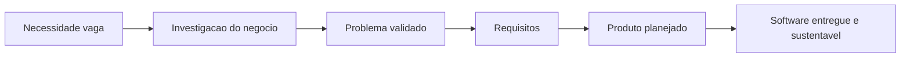
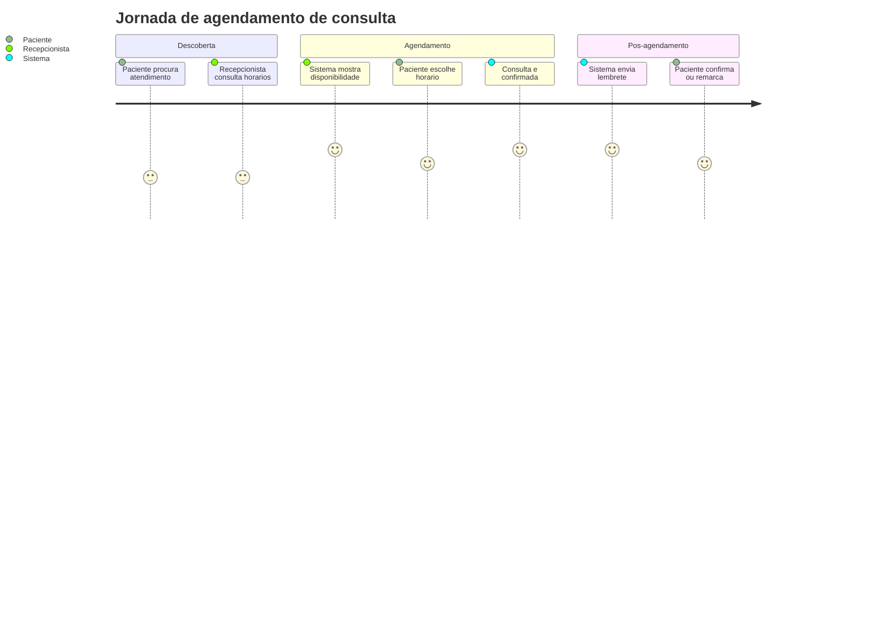
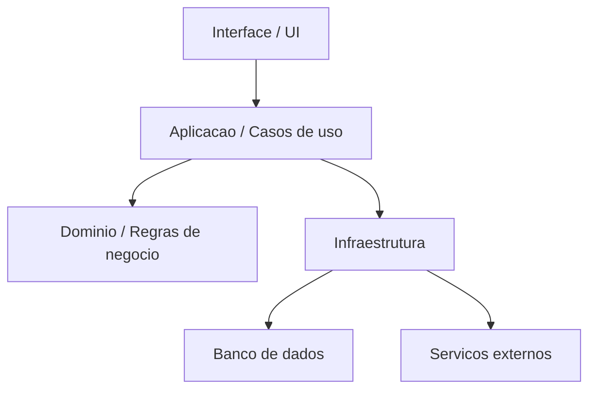
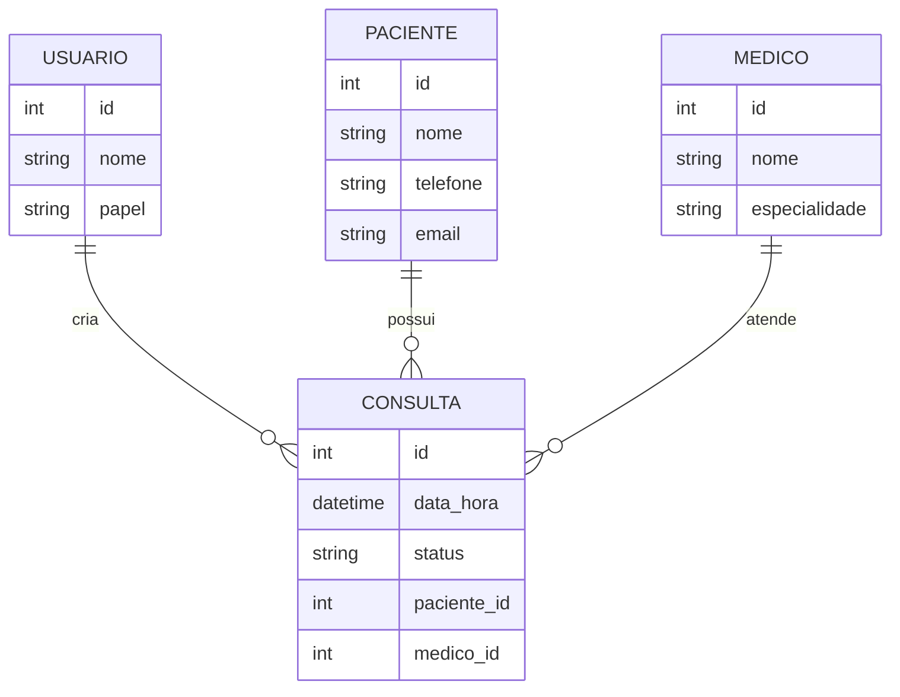
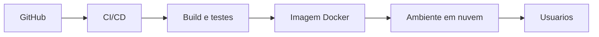
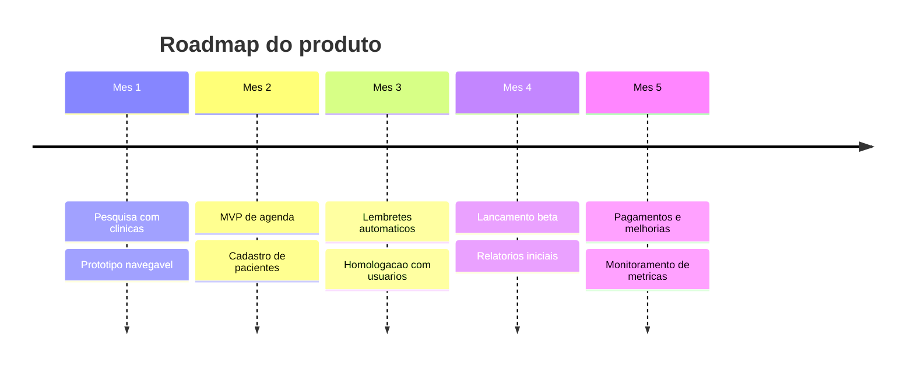

# Aula: Como Elicitar um Negocio para Produzir um Software

## Tema

Elicitacao de negocio, levantamento de requisitos e planejamento de produto para criacao de software, sistemas, jogos ou plataformas digitais.

## Objetivo da aula

Ao final desta aula, o aluno devera ser capaz de:

- Entender o que significa elicitar um negocio antes de construir software.
- Identificar problemas, usuarios, objetivos, restricoes e oportunidades.
- Transformar necessidades de negocio em requisitos funcionais e nao funcionais.
- Definir fundamentos de seguranca da informacao, UX/UI, arquitetura, dados, nuvem, sustentacao e gestao.
- Elaborar um plano de negocios/produto no papel de Product Manager.
- Organizar documentacao, repositorio GitHub e estrategia de evolucao do produto.

## Publico-alvo

Alunos, analistas de requisitos, product managers iniciantes, desenvolvedores, designers, empreendedores e equipes que desejam estruturar melhor a criacao de produtos digitais.

## Roteiro da aula

1. O que e elicitar um negocio
2. Como entender o problema antes da solucao
3. Stakeholders, usuarios e jornadas
4. Requisitos funcionais e nao funcionais
5. UX/UI basico para software, sistema ou jogo
6. Seguranca da informacao desde o inicio
7. Arquitetura, persistencia de dados e nuvem
8. Documentacao tecnica e de produto
9. O que deve existir no GitHub
10. Sustentacao, operacao e gestao
11. Plano de negocios do Product Manager
12. Glossario, exemplos e checklists

---

# 1. O que e elicitar um negocio

Elicitar um negocio e o processo de descobrir, organizar e validar informacoes sobre uma necessidade real antes de construir uma solucao digital.

Elicitar nao e apenas perguntar "qual sistema voce quer?". Muitas vezes o cliente pede uma solucao, mas ainda nao explicou corretamente o problema.

Exemplo:

> Cliente: "Quero um aplicativo para controlar estoque."

Perguntas de elicitacao:

- Que problema o estoque causa hoje?
- Quem sofre com esse problema?
- Quanto tempo ou dinheiro e perdido?
- Quais produtos precisam ser controlados?
- O controle precisa funcionar offline?
- Ha integracao com vendas, notas fiscais ou fornecedores?
- Quem pode alterar quantidades?
- Existe auditoria de movimentacoes?

Perceba que a demanda inicial era "um aplicativo", mas o problema real pode ser falta de rastreabilidade, perda financeira, erro humano, fraude ou baixa previsibilidade de compras.

## Objetivo da elicitacao

O objetivo e transformar uma ideia vaga em uma visao clara de produto:



---

# 2. Entendendo o problema antes da solucao

Uma boa equipe nao comeca pela tela, pelo banco de dados ou pela linguagem de programacao. Ela comeca pelo problema.

## Perguntas essenciais

### Problema

- Qual problema queremos resolver?
- Como ele e resolvido hoje?
- O que acontece se nada for feito?
- Esse problema e frequente?
- Ele tem impacto financeiro, operacional, legal ou reputacional?

### Publico

- Quem usa o produto?
- Quem paga pelo produto?
- Quem decide a compra?
- Quem da suporte?
- Quem pode bloquear a adocao?

### Contexto

- O sistema sera usado em escritorio, loja, fabrica, escola, hospital ou casa?
- O uso sera em desktop, celular, tablet, terminal ou console?
- Ha limitacoes de internet, equipamento, tempo ou treinamento?

### Sucesso

- Como saberemos que o produto deu certo?
- Qual indicador deve melhorar?
- O que significa valor para o usuario?

## Exemplo pratico

Ideia inicial:

> Criar um sistema para agendamento de consultas.

Problema refinado:

> Clinicas pequenas perdem receita porque pacientes esquecem consultas, recepcionistas fazem controles manuais e nao ha visibilidade de horarios ociosos.

Produto possivel:

> Sistema web/mobile de agendamento com confirmacao automatica, lembretes, painel da recepcao, cadastro de pacientes, historico de atendimentos e relatorios de ausencia.

Indicadores:

- Reduzir faltas em 30%.
- Diminuir tempo de agendamento por telefone.
- Aumentar ocupacao da agenda.
- Melhorar experiencia do paciente.

---

# 3. Stakeholders, usuarios e jornadas

Stakeholder e qualquer pessoa ou grupo afetado pelo produto.

## Tipos de stakeholders

| Tipo | Exemplo | Interesse |
|---|---|---|
| Usuario final | Cliente, aluno, jogador, paciente | Usar o produto com facilidade |
| Comprador | Empresa, gestor, patrocinador | Retorno sobre investimento |
| Operador | Atendente, professor, suporte | Executar tarefas com eficiencia |
| Administrador | TI, seguranca, gestor | Controle, permissao e auditoria |
| Regulador | Governo, juridico, compliance | Leis, normas e privacidade |
| Equipe tecnica | Devs, QA, DevOps | Manutencao, qualidade e evolucao |

## Persona

Persona e uma representacao de um usuario real ou provavel.

Exemplo:

**Nome:** Ana, recepcionista de clinica  
**Objetivo:** Marcar consultas rapidamente  
**Dor:** Usa planilha e telefone, comete erros em horarios  
**Necessidade:** Ver agenda por medico, remarcar facil e enviar lembretes  
**Risco:** Se o sistema for lento, ela volta para a planilha

## Jornada do usuario

Jornada e o caminho que o usuario percorre para atingir um objetivo.



---

# 4. Tecnicas de elicitacao

## Entrevistas

Conversas estruturadas ou semiestruturadas com stakeholders.

Boas perguntas:

- Como voce executa essa tarefa hoje?
- O que mais demora?
- Onde acontecem erros?
- Que informacoes voce precisa para decidir?
- Que relatorios voce usa?
- O que voce nao aceitaria perder no sistema atual?

## Observacao

Consiste em observar o usuario trabalhando. E util porque muitas pessoas nao conseguem explicar tudo que fazem.

Exemplo:

Um usuario diz: "Eu so cadastro o pedido."  
Na observacao, voce percebe que ele tambem consulta estoque, liga para fornecedor, verifica credito e atualiza planilha.

## Workshop

Reuniao colaborativa para alinhar visao, processos e prioridades.

Pode incluir:

- Mapa de processos
- Priorizacao de funcionalidades
- Identificacao de riscos
- Definicao de MVP
- Validacao de jornadas

## Questionarios

Bons para coletar opiniao de muitos usuarios.

Use quando:

- Ha grande numero de usuarios.
- Voce precisa medir frequencia.
- Voce quer comparar preferencias.

## Analise documental

Consiste em estudar documentos existentes:

- Planilhas
- Contratos
- Formularios
- Relatorios
- Normas
- Manuais
- Sistemas legados

## Prototipacao

Criar telas simples para validar entendimento.

Pode ser:

- Desenho em papel
- Wireframe
- Protótipo no Figma
- Protótipo navegavel
- MVP funcional

---

# 5. Requisitos

Requisitos descrevem o que o produto precisa fazer e quais qualidades ele deve ter.

## Requisitos funcionais

Sao funcionalidades do sistema.

Exemplos:

- O sistema deve permitir cadastro de usuarios.
- O sistema deve enviar notificacao de confirmacao.
- O jogo deve salvar o progresso do jogador.
- O administrador deve poder bloquear contas.
- O usuario deve conseguir recuperar senha.

## Requisitos nao funcionais

Sao criterios de qualidade, restricoes ou caracteristicas do sistema.

Exemplos:

- O sistema deve carregar a tela inicial em ate 2 segundos.
- Os dados sensiveis devem ser criptografados.
- A aplicacao deve estar disponivel 99,5% do tempo.
- O jogo deve rodar a 60 FPS em hardware recomendado.
- O sistema deve atender a LGPD.

## Regra de negocio

Define uma condicao ou politica do negocio.

Exemplos:

- Um cliente inadimplente nao pode fazer nova compra a prazo.
- Uma consulta so pode ser cancelada ate 24 horas antes.
- Um cupom nao pode ser usado duas vezes pelo mesmo usuario.
- Um jogador nao pode trocar item durante uma partida ranqueada.

## User story

Formato comum em metodologias ageis:

> Como [tipo de usuario], quero [objetivo], para [beneficio].

Exemplo:

> Como recepcionista, quero visualizar os horarios disponiveis por medico, para agendar consultas sem conflito.

## Criterios de aceitacao

Definem como saber se uma funcionalidade foi entregue corretamente.

Exemplo:

Historia:

> Como usuario, quero recuperar minha senha para voltar a acessar minha conta.

Criterios:

- Deve haver opcao "esqueci minha senha".
- O usuario deve informar e-mail cadastrado.
- O sistema deve enviar link temporario.
- O link deve expirar.
- A nova senha deve cumprir politica minima de seguranca.

---

# 6. MVP e escopo

MVP significa Minimum Viable Product, ou Produto Minimo Viavel.

Nao e um produto ruim. E a menor versao que permite validar valor real.

## Exemplo de escopo

Produto: sistema de agendamento medico.

### MVP

- Login
- Cadastro de pacientes
- Cadastro de medicos
- Agenda
- Criacao de consulta
- Confirmacao por e-mail

### Depois do MVP

- Pagamento online
- Telemedicina
- Integracao com WhatsApp
- Relatorios avancados
- Aplicativo mobile
- IA para previsao de faltas

## Priorizacao MoSCoW

| Categoria | Significado | Exemplo |
|---|---|---|
| Must have | Precisa ter | Login e agenda |
| Should have | Deveria ter | Lembretes automaticos |
| Could have | Poderia ter | Tema escuro |
| Won't have now | Nao tera agora | Integracao com todos os planos de saude |

---

# 7. UX/UI basico para software, sistema ou jogo

UX significa User Experience, ou Experiencia do Usuario. UI significa User Interface, ou Interface do Usuario.

UX trata da experiencia completa. UI trata da camada visual e interativa.

## O que todo produto deve ter em UX

- Clareza sobre o que o usuario pode fazer.
- Navegacao simples.
- Feedback apos acoes importantes.
- Mensagens de erro compreensiveis.
- Consistencia entre telas.
- Acessibilidade.
- Tempo de resposta adequado.
- Fluxos que respeitam o contexto do usuario.

## O que toda interface deve ter

- Hierarquia visual.
- Contraste adequado.
- Tipografia legivel.
- Espacamento consistente.
- Botoes com aparencia de botoes.
- Estados de carregamento.
- Estados vazios.
- Estados de erro.
- Confirmacao para acoes destrutivas.
- Design responsivo quando necessario.

## Exemplo de fluxo ruim

Usuario tenta cadastrar um produto:

1. Preenche 20 campos.
2. Clica em salvar.
3. O sistema informa "erro".
4. Nenhum campo e destacado.
5. O usuario perde os dados preenchidos.

## Exemplo de fluxo melhor

1. Campos sao agrupados por secao.
2. Campos obrigatorios sao claros.
3. Erros aparecem perto do campo.
4. Dados nao sao perdidos.
5. Usuario recebe confirmacao: "Produto cadastrado com sucesso."

## UX em jogos

Em jogos, UX tambem envolve:

- Tutorial.
- Curva de aprendizado.
- Feedback visual e sonoro.
- Balanceamento.
- Legibilidade dos objetivos.
- Salvamento de progresso.
- Controles intuitivos.
- Acessibilidade para diferentes jogadores.
- Experiencia de falha justa.

---

# 8. Seguranca da informacao basica

Seguranca deve ser pensada desde a concepcao do produto, nao apenas no final.

## Principios fundamentais

### Confidencialidade

Apenas pessoas autorizadas acessam a informacao.

Exemplo:

- Um usuario comum nao pode ver dados financeiros de outro usuario.

### Integridade

A informacao nao deve ser alterada indevidamente.

Exemplo:

- O saldo de uma carteira digital nao pode ser modificado por requisicao manipulada.

### Disponibilidade

O sistema deve estar acessivel quando necessario.

Exemplo:

- Um sistema de vendas nao pode ficar fora do ar em horario comercial critico.

## Controles basicos de seguranca

### Autenticacao

Verifica quem e o usuario.

Boas praticas:

- Senhas fortes.
- MFA quando possivel.
- Recuperacao de senha segura.
- Bloqueio ou protecao contra tentativas abusivas.

### Autorizacao

Define o que cada usuario pode fazer.

Exemplo de papeis:

- Admin
- Gestor
- Operador
- Cliente
- Visitante

### Criptografia

Usar criptografia para proteger dados:

- Em transito: HTTPS/TLS.
- Em repouso: banco, backups, arquivos sensiveis.
- Senhas: nunca salvar senha pura; usar hash seguro.

### Logs e auditoria

Registrar eventos importantes:

- Login.
- Falha de login.
- Alteracao de permissao.
- Exclusao de dados.
- Movimentacoes financeiras.
- Alteracoes administrativas.

### Validacao de entrada

Nunca confiar cegamente no que vem do usuario.

Prevenir:

- SQL injection.
- Cross-site scripting.
- Upload malicioso.
- Manipulacao de parametros.
- Dados fora do formato esperado.

### LGPD e privacidade

Perguntas importantes:

- Quais dados pessoais sao coletados?
- Por que eles sao necessarios?
- Onde ficam armazenados?
- Quem acessa?
- Por quanto tempo ficam guardados?
- Como o usuario pode solicitar exclusao ou correcao?

## Checklist minimo de seguranca

- Login seguro.
- Controle de acesso por perfil.
- HTTPS.
- Senhas com hash.
- Protecao contra ataques comuns.
- Backup.
- Logs de auditoria.
- Politica de privacidade.
- Minimizacao de dados pessoais.
- Segredos fora do codigo-fonte.
- Revisao de dependencias.

---

# 9. Documentacao de requisitos

Documentar requisitos nao e burocracia; e reduzir ambiguidade.

## Documentos importantes

### Visao do produto

Contem:

- Problema.
- Publico-alvo.
- Objetivos.
- Beneficios.
- Escopo inicial.
- Fora de escopo.
- Indicadores de sucesso.

### Backlog

Lista priorizada de funcionalidades, melhorias, bugs e tarefas tecnicas.

### Especificacao de requisitos

Pode conter:

- Requisitos funcionais.
- Requisitos nao funcionais.
- Regras de negocio.
- Fluxos.
- Prototipos.
- Criterios de aceitacao.
- Premissas.
- Restricoes.

### Matriz de rastreabilidade

Liga requisito, objetivo de negocio, historia, teste e entrega.

| Objetivo | Requisito | Historia | Teste |
|---|---|---|---|
| Reduzir faltas | Enviar lembrete | US-12 | CT-08 |

---

# 10. O que deve ter no GitHub

Um repositorio profissional comunica qualidade.

## Estrutura minima

```text
meu-produto/
  README.md
  LICENSE
  .gitignore
  .env.example
  docs/
    requisitos.md
    arquitetura.md
    api.md
    decisoes/
      ADR-001-escolha-do-banco.md
  src/
  tests/
  scripts/
  docker-compose.yml
  Dockerfile
  CHANGELOG.md
  CONTRIBUTING.md
  SECURITY.md
```

## README.md

Deve explicar:

- O que e o projeto.
- Qual problema resolve.
- Como instalar.
- Como executar.
- Como rodar testes.
- Variaveis de ambiente.
- Tecnologias usadas.
- Como contribuir.
- Status do projeto.

## .env.example

Exemplo de variaveis sem segredos reais:

```env
DATABASE_URL=
JWT_SECRET=
API_BASE_URL=
EMAIL_PROVIDER_KEY=
```

## SECURITY.md

Explica:

- Como reportar vulnerabilidades.
- Quais versoes sao suportadas.
- Politicas de seguranca.

## Issues e Pull Requests

Boas praticas:

- Usar issues para demandas.
- Usar labels.
- Criar pull requests pequenos.
- Revisar codigo.
- Rodar testes antes de merge.
- Proteger a branch principal.

## GitHub Actions

Automacoes recomendadas:

- Rodar testes.
- Rodar lint.
- Verificar build.
- Verificar dependencias vulneraveis.
- Publicar imagem Docker.
- Fazer deploy em ambiente de homologacao.

---

# 11. Arquitetura de software

Arquitetura e o conjunto de decisoes importantes sobre estrutura, comunicacao, tecnologias e evolucao do sistema.

## Perguntas arquiteturais

- O sistema sera monolitico ou distribuido?
- Havera API?
- Quem consome a API?
- O sistema precisa escalar?
- Precisa operar offline?
- Quais partes sao mais criticas?
- Ha integracao com terceiros?
- Quais dados sao sensiveis?

## Arquitetura em camadas



## Exemplo simples

Sistema de agendamento:

- Frontend: React, Vue ou Angular.
- Backend: Node.js, Java, Python, C# etc.
- Banco: PostgreSQL.
- Cache: Redis, se necessario.
- Autenticacao: JWT, OAuth ou sessao.
- Deploy: Docker em nuvem.
- Observabilidade: logs, metricas e alertas.

## Monolito vs microsservicos

| Modelo | Vantagem | Risco |
|---|---|---|
| Monolito | Simples de desenvolver e operar no inicio | Pode crescer de forma desorganizada |
| Microsservicos | Escala times e dominios separados | Aumenta complexidade operacional |

Regra pratica:

> Comece simples, mas com separacao clara de responsabilidades.

---

# 12. Persistencia de dados

Persistencia e como o sistema armazena e recupera dados.

## Tipos comuns

### Banco relacional

Exemplos:

- PostgreSQL
- MySQL
- SQL Server

Bom para:

- Dados estruturados.
- Relacionamentos.
- Transacoes.
- Relatorios consistentes.

### Banco NoSQL

Exemplos:

- MongoDB
- DynamoDB
- Firestore

Bom para:

- Dados flexiveis.
- Escala horizontal.
- Documentos.
- Eventos.

### Armazenamento de arquivos

Exemplos:

- AWS S3
- Google Cloud Storage
- Azure Blob Storage

Bom para:

- Imagens.
- Videos.
- PDFs.
- Backups.

## Modelo de dados basico

Exemplo para agenda:



## Cuidados

- Definir backups.
- Criar indices.
- Controlar migracoes.
- Proteger dados sensiveis.
- Documentar modelo.
- Planejar retencao e exclusao.

---

# 13. Nuvem e infraestrutura

Nuvem permite hospedar aplicacoes, bancos, arquivos e servicos com escalabilidade.

## Provedores comuns

- AWS
- Azure
- Google Cloud
- Oracle Cloud
- DigitalOcean
- Render
- Vercel
- Netlify
- Railway

## Ambientes

| Ambiente | Uso |
|---|---|
| Desenvolvimento | Uso local pela equipe |
| Homologacao | Testes antes de producao |
| Producao | Usuarios reais |

## Componentes comuns

- Servidor de aplicacao.
- Banco de dados.
- Storage de arquivos.
- Balanceador de carga.
- DNS.
- Certificado SSL.
- Monitoramento.
- Backup.
- Pipeline de deploy.

## Deploy basico



## Cuidados de custo

- Estimar uso.
- Monitorar consumo.
- Definir alertas de gasto.
- Evitar recursos ligados sem necessidade.
- Escolher servicos gerenciados quando fizer sentido.

---

# 14. Sustentacao e operacao

Sustentacao e o conjunto de processos para manter o produto funcionando depois do lancamento.

## O que precisa existir

- Monitoramento.
- Logs.
- Alertas.
- Processo de incidentes.
- Backup e restauracao.
- Atualizacoes de seguranca.
- Canal de suporte.
- Base de conhecimento.
- Priorizacao de bugs.
- SLA ou expectativa de atendimento.

## Exemplo de severidade

| Severidade | Exemplo | Resposta |
|---|---|---|
| Critica | Sistema fora do ar | Atuar imediatamente |
| Alta | Pagamento falhando | Corrigir com prioridade |
| Media | Relatorio com erro | Planejar correcao |
| Baixa | Ajuste visual pequeno | Entrar no backlog |

## Observabilidade

Observabilidade e a capacidade de entender o que acontece dentro do sistema.

Inclui:

- Logs: eventos.
- Metricas: numeros.
- Traces: caminho de uma requisicao.
- Alertas: avisos automaticos.

---

# 15. Gestao do produto e do projeto

Gestao garante que o produto avance com foco, qualidade e previsibilidade.

## Papeis

| Papel | Responsabilidade |
|---|---|
| Product Manager | Define problema, estrategia, prioridades e valor |
| Product Owner | Detalha backlog e aceita entregas |
| Tech Lead | Orienta arquitetura e decisao tecnica |
| UX/UI Designer | Desenha experiencia e interface |
| Desenvolvedor | Implementa |
| QA/Testador | Valida qualidade |
| DevOps/SRE | Cuida de deploy, infraestrutura e confiabilidade |
| Stakeholder | Define necessidades e restricoes de negocio |

## Cerimonias ageis

- Planning.
- Daily.
- Review.
- Retrospective.
- Refinamento de backlog.

## Indicadores de gestao

- Velocidade do time.
- Lead time.
- Taxa de bugs.
- Disponibilidade.
- Satisfacao do usuario.
- Conversao.
- Retencao.
- Receita.
- Custo de infraestrutura.

---

# 16. Plano de negocios que o Product Manager faria

O Product Manager deve conectar negocio, usuario e tecnologia.

## 16.1 Sumario executivo

Nome do produto:

> AgendaPlus

Proposta:

> Plataforma de agendamento para clinicas pequenas e medias, com foco em reduzir faltas, organizar horarios e melhorar a comunicacao com pacientes.

Problema:

> Clinicas perdem receita por faltas, agenda manual, retrabalho e baixa previsibilidade de atendimento.

Solucao:

> Sistema web com agenda, cadastro de pacientes, lembretes automaticos, painel administrativo e relatorios operacionais.

## 16.2 Publico-alvo

- Clinicas medicas.
- Consultorios odontologicos.
- Psicologos.
- Fisioterapeutas.
- Pequenas redes de atendimento.

## 16.3 Proposta de valor

Para clinicas que perdem tempo e receita com agendamento manual, o produto oferece uma agenda digital simples, lembretes automaticos e indicadores de ocupacao, reduzindo faltas e aumentando previsibilidade operacional.

## 16.4 Diferenciais

- Implantacao simples.
- Interface clara para recepcionistas.
- Lembretes automaticos.
- Relatorios de ausencia.
- Controle de perfis.
- Historico de paciente.
- Baixo custo inicial.

## 16.5 Modelo de receita

Possibilidades:

- Assinatura mensal por clinica.
- Plano por numero de profissionais.
- Plano gratuito limitado.
- Taxa por mensagem enviada.
- Plano premium com relatorios avancados.

Exemplo:

| Plano | Preco | Recursos |
|---|---:|---|
| Basico | R$ 59/mes | 1 profissional, agenda e pacientes |
| Profissional | R$ 149/mes | Ate 5 profissionais, lembretes e relatorios |
| Clinica | R$ 299/mes | Multiunidade, perfis e auditoria |

## 16.6 Mercado e concorrencia

Perguntas:

- Quantas clinicas existem no mercado-alvo?
- Elas ja usam sistemas?
- Quanto pagam?
- O que reclamam dos concorrentes?
- Qual nicho inicial e mais acessivel?

Concorrentes podem ser:

- Planilhas.
- Agenda de papel.
- Sistemas legados.
- WhatsApp manual.
- Plataformas SaaS consolidadas.

## 16.7 MVP

Funcionalidades do MVP:

- Login.
- Cadastro de pacientes.
- Cadastro de profissionais.
- Agenda diaria/semanal.
- Criacao, edicao e cancelamento de consulta.
- Lembrete por e-mail.
- Painel simples de consultas do dia.

Fora do MVP:

- App nativo.
- IA.
- Pagamento online.
- Integracao com operadoras.
- Telemedicina.

## 16.8 Roadmap



## 16.9 Metricas de sucesso

### Produto

- Numero de clinicas cadastradas.
- Usuarios ativos semanais.
- Consultas agendadas por semana.
- Taxa de confirmacao.
- Taxa de faltas.

### Negocio

- Receita mensal recorrente.
- Churn.
- CAC.
- LTV.
- Conversao de trial para pago.

### Experiencia

- Tempo medio para agendar consulta.
- NPS.
- Tickets de suporte por cliente.
- Taxa de erro em cadastro.

## 16.10 Riscos

| Risco | Impacto | Mitigacao |
|---|---|---|
| Clinicas nao adotarem | Alto | Testar prototipo antes de construir |
| Custo de mensagens alto | Medio | Comecar com e-mail e cobrar SMS/WhatsApp |
| Dados sensiveis | Alto | LGPD, controle de acesso e auditoria |
| Concorrencia forte | Medio | Nichar em pequenas clinicas |
| Produto complexo demais | Alto | MVP enxuto |

## 16.11 Go-to-market

Estrategia de entrada:

- Comecar por clinicas pequenas.
- Fazer pilotos com 3 a 5 clientes.
- Coletar depoimentos.
- Criar landing page.
- Produzir conteudo para recepcionistas e gestores.
- Oferecer onboarding assistido.

## 16.12 Estrategia de precificacao

Considerar:

- Valor economizado por reducao de faltas.
- Numero de profissionais.
- Custo de infraestrutura.
- Custo de suporte.
- Preco dos concorrentes.
- Disposicao a pagar.

## 16.13 Operacao

Necessario definir:

- Quem atende suporte.
- Horario de atendimento.
- SLA.
- Processo de incidente.
- Treinamento do cliente.
- Base de conhecimento.
- Politica de cancelamento.

---

# 17. Itens importantes nao citados inicialmente

## Testes

Todo produto deve ter estrategia de testes.

Tipos:

- Teste unitario.
- Teste de integracao.
- Teste end-to-end.
- Teste de usabilidade.
- Teste de seguranca.
- Teste de performance.
- Teste de regressao.

## Acessibilidade

Um sistema deve considerar pessoas com diferentes capacidades.

Cuidados:

- Contraste.
- Navegacao por teclado.
- Texto alternativo.
- Labels em formularios.
- Tamanho de fonte.
- Evitar depender apenas de cor.

## Compliance

Dependendo do produto:

- LGPD.
- Normas de saude.
- Normas financeiras.
- Politicas internas.
- Termos de uso.
- Politica de privacidade.

## Internacionalizacao

Se o produto pode crescer:

- Idiomas.
- Moedas.
- Fusos horarios.
- Formatos de data.
- Regras regionais.

## Performance

Definir metas:

- Tempo de carregamento.
- Tempo de resposta da API.
- Capacidade de usuarios simultaneos.
- Tamanho maximo de upload.
- FPS, no caso de jogos.

## Analytics

Medir comportamento:

- Quais telas sao mais usadas.
- Onde usuarios abandonam.
- Quais erros ocorrem.
- Quais funcionalidades geram valor.

---

# 18. Exemplo completo: da ideia ao produto

## Ideia

> Quero criar um jogo educativo para ensinar logica de programacao.

## Problema

Alunos iniciantes acham programacao abstrata, desmotivadora e dificil de praticar.

## Usuarios

- Alunos do ensino medio.
- Professores de informatica.
- Escolas.

## Solucao

Jogo em fases onde o aluno resolve desafios de logica usando blocos de comando.

## Requisitos funcionais

- Criar conta.
- Escolher fase.
- Arrastar blocos de comando.
- Executar solucao.
- Mostrar feedback.
- Salvar progresso.
- Professor visualizar desempenho da turma.

## Requisitos nao funcionais

- Rodar no navegador.
- Ser responsivo para tablets.
- Salvar progresso automaticamente.
- Proteger dados de alunos.
- Carregar fase em ate 3 segundos.

## UX/UI

- Tutorial inicial.
- Linguagem simples.
- Feedback visual imediato.
- Dificuldade gradual.
- Tela sem excesso de informacao.

## Seguranca

- Login seguro.
- Controle de perfil aluno/professor.
- Protecao de dados de menores.
- Logs administrativos.
- Consentimento quando necessario.

## Persistencia

- Usuarios.
- Turmas.
- Fases.
- Progresso.
- Pontuacao.

## GitHub

- README.
- Documentacao de regras do jogo.
- Guia de instalacao.
- Testes.
- Issues por fase.
- GitHub Actions.

## Nuvem

- Frontend em Vercel/Netlify.
- Backend em servidor gerenciado.
- Banco PostgreSQL.
- Storage para assets.

## Plano de negocios

- Cliente: escolas.
- Usuario: alunos e professores.
- Receita: assinatura por escola.
- MVP: 10 fases, painel simples do professor.
- Metrica: taxa de conclusao das fases.

---

# 19. Checklist geral para iniciar um produto de software

## Negocio

- Problema definido.
- Publico-alvo identificado.
- Stakeholders mapeados.
- Proposta de valor clara.
- Indicadores de sucesso definidos.
- Concorrentes analisados.

## Produto

- MVP definido.
- Requisitos funcionais documentados.
- Requisitos nao funcionais documentados.
- Regras de negocio descritas.
- Backlog priorizado.
- Roadmap inicial.

## UX/UI

- Personas.
- Jornadas.
- Fluxos principais.
- Wireframes.
- Estados de erro, vazio e carregamento.
- Acessibilidade considerada.

## Seguranca

- Autenticacao.
- Autorizacao.
- HTTPS.
- Hash de senhas.
- Logs.
- Backup.
- Politica de privacidade.
- Segredos fora do codigo.

## Tecnologia

- Arquitetura inicial.
- Banco definido.
- Modelo de dados inicial.
- Estrategia de deploy.
- Ambientes separados.
- Monitoramento.
- Testes.

## GitHub

- README.
- .gitignore.
- .env.example.
- LICENSE.
- Docs.
- Issues.
- Pull requests.
- Actions.
- SECURITY.md.

## Gestao

- Papeis definidos.
- Rituais definidos.
- Processo de priorizacao.
- Processo de suporte.
- Metricas acompanhadas.
- Plano de riscos.

---

# 20. Glossario

## Backlog

Lista priorizada de tudo que pode ser feito no produto.

## Elicitacao

Processo de descobrir e entender necessidades de negocio e usuarios.

## MVP

Menor versao viavel do produto para validar valor real.

## Stakeholder

Pessoa ou grupo interessado ou impactado pelo produto.

## Persona

Representacao de um usuario baseada em caracteristicas reais ou esperadas.

## Requisito funcional

Funcionalidade que o sistema deve executar.

## Requisito nao funcional

Caracteristica de qualidade ou restricao do sistema.

## Regra de negocio

Politica, condicao ou regra especifica do dominio.

## UX

Experiencia do usuario ao interagir com o produto.

## UI

Interface visual e interativa do produto.

## CI/CD

Automacao de integracao, testes e deploy.

## SLA

Acordo de nivel de servico.

## LGPD

Lei Geral de Protecao de Dados.

## Arquitetura

Conjunto de decisoes estruturais sobre o funcionamento do sistema.

## Persistencia

Forma como os dados sao armazenados e recuperados.

## Observabilidade

Capacidade de entender o comportamento interno de um sistema por logs, metricas e traces.

---

# 21. Atividade em sala

## Proposta

Dividir a turma em grupos. Cada grupo devera escolher uma ideia de software, sistema ou jogo e preencher:

1. Problema.
2. Publico-alvo.
3. Stakeholders.
4. Proposta de valor.
5. MVP.
6. Cinco requisitos funcionais.
7. Cinco requisitos nao funcionais.
8. Tres riscos.
9. Modelo de dados inicial.
10. Estrutura minima do GitHub.
11. Plano de negocio resumido.

## Entrega

Cada grupo deve apresentar em 5 minutos:

- Qual problema resolvera.
- Para quem.
- Como o produto funciona.
- O que entra no MVP.
- Como cuidara de seguranca, UX, dados e sustentacao.

---

# 22. Modelo resumido para preencher

## Nome do produto

Preencher aqui.

## Problema

Preencher aqui.

## Publico-alvo

Preencher aqui.

## Stakeholders

Preencher aqui.

## Proposta de valor

Preencher aqui.

## MVP

Preencher aqui.

## Requisitos funcionais

1. 
2. 
3. 
4. 
5. 

## Requisitos nao funcionais

1. 
2. 
3. 
4. 
5. 

## Regras de negocio

1. 
2. 
3. 

## Arquitetura inicial

Preencher aqui.

## Persistencia de dados

Preencher aqui.

## Seguranca

Preencher aqui.

## UX/UI

Preencher aqui.

## GitHub

Preencher aqui.

## Nuvem

Preencher aqui.

## Sustentacao

Preencher aqui.

## Plano de negocio

Preencher aqui.

---

# 23. Fechamento

Elicitar um negocio e reduzir incerteza antes de gastar tempo e dinheiro construindo software. Um bom produto nasce quando a equipe entende profundamente o problema, os usuarios, as restricoes, o contexto tecnico e o modelo de negocio.

Software nao e apenas codigo. Um produto digital bem planejado precisa de:

- Valor de negocio.
- Experiencia de usuario.
- Seguranca.
- Dados bem modelados.
- Arquitetura adequada.
- Documentacao.
- Processo de entrega.
- Sustentacao.
- Gestao continua.

A melhor pergunta para iniciar um projeto nao e:

> Que sistema vamos construir?

E sim:

> Que problema real vamos resolver, para quem, com qual valor e com quais responsabilidades?

