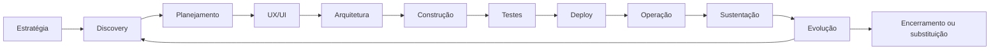
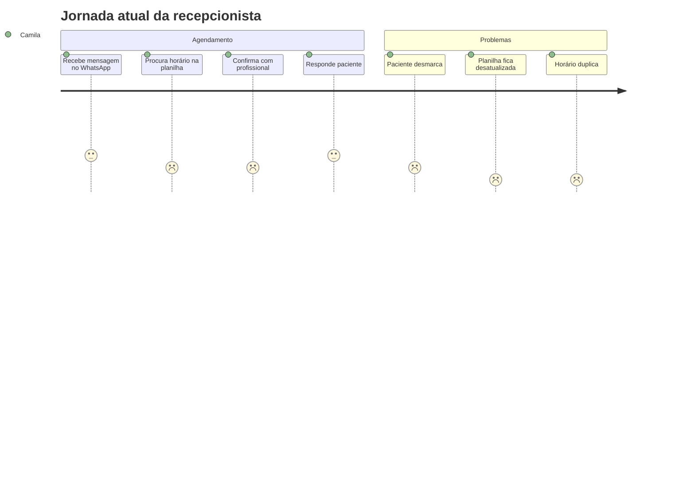
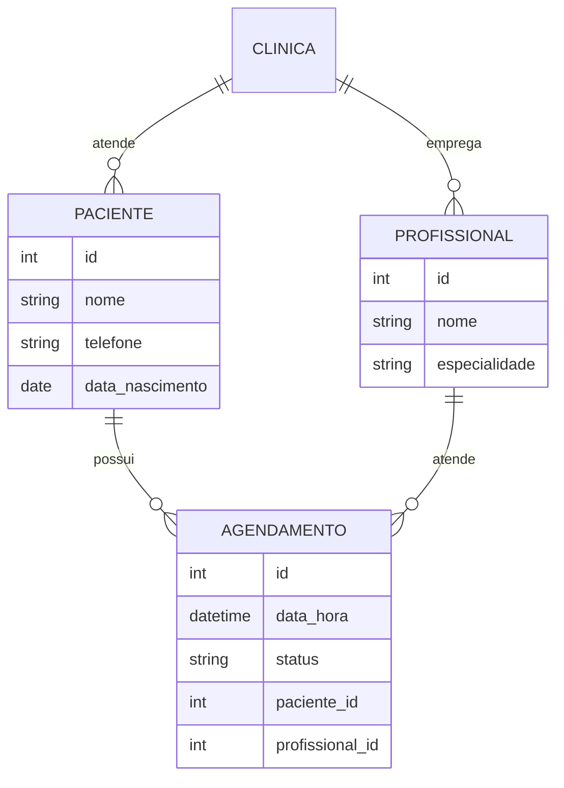
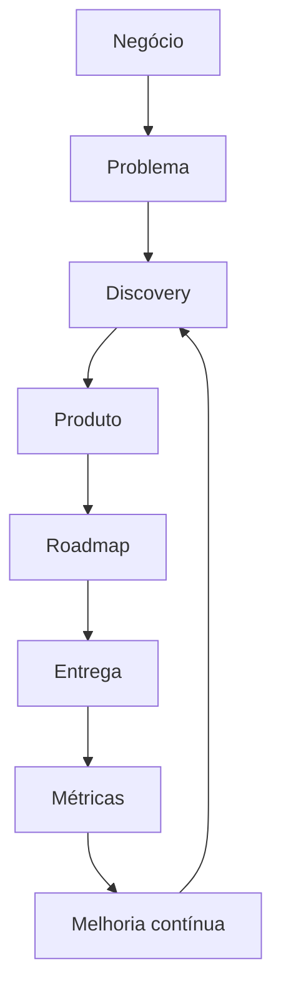

# Aula: Roadmap Completo de Desenvolvimento de Software

## Da ideia ao encerramento de um produto digital

**Objetivo da aula:** ensinar, de forma prática e organizada, como um software nasce, é planejado, desenhado, construído, testado, publicado, operado, evoluído e, quando necessário, substituído.

**Público-alvo:** estudantes de Engenharia de Software, Gestão de Produtos, Requisitos, Arquitetura, Desenvolvimento, QA, DevOps e disciplinas introdutórias de tecnologia.

**Produto exemplo usado na aula:** um sistema chamado **Agenda Saúde**, uma aplicação web para clínicas gerenciarem agendamentos, pacientes, profissionais, prontuários simplificados e relatórios.


---

## 1. Ideia central

O desenvolvimento de software não começa na programação e não termina quando o sistema é publicado.

Um produto digital passa por um ciclo completo:



A parte mais importante para a turma entender é esta: **software é um processo de decisão contínua**. Programar é uma etapa fundamental, mas vem depois de muitas decisões sobre problema, usuário, negócio, experiência, arquitetura e qualidade.

---

## 2. Visão geral das fases

| Fase | Nome | Pergunta principal | Principal entrega |
|---:|---|---|---|
| 0 | Estratégia e Negócio | Vale a pena criar? | Business case / Canvas |
| 1 | Discovery | Qual problema resolver? | Personas, jornadas, MVP |
| 2 | Planejamento | O que será feito primeiro? | Backlog e roadmap |
| 3 | UX/UI | Como o usuário vai usar? | Protótipo e design system |
| 4 | Arquitetura | Como o sistema será estruturado? | Diagramas e decisões técnicas |
| 5 | Construção | Como implementar? | Código, APIs, banco |
| 6 | Testes | Funciona com qualidade? | Evidências e relatórios |
| 7 | Deploy | Como publicar? | Pipeline e ambiente produtivo |
| 8 | Operação | Está funcionando bem? | Monitoramento e suporte |
| 9 | Sustentação | Como manter saudável? | Correções e atualizações |
| 10 | Evolução | Como aumentar valor? | Novas versões |
| 11 | Encerramento | Deve continuar existindo? | Migração e desativação |

---

## 3. Papéis envolvidos


| Papel | Responsabilidade principal |
|---|---|
| Product Manager | Garantir valor para usuário e negócio |
| Product Owner | Detalhar backlog, prioridades e critérios |
| UX/UI Designer | Desenhar fluxos, telas e experiência |
| Arquiteto de Software | Definir estrutura técnica e decisões críticas |
| Desenvolvedor | Implementar frontend, backend, banco e integrações |
| QA/Testes | Validar qualidade funcional e não funcional |
| DevOps/SRE | Automatizar deploy, monitorar e operar |
| Suporte/Operação | Atender usuários e incidentes |
| Segurança | Avaliar riscos, acessos, privacidade e vulnerabilidades |

---

# Fase 0 - Estratégia e Negócio

## Objetivo

Descobrir se vale a pena investir tempo, dinheiro e equipe no produto.

Antes de perguntar "como vamos programar?", a equipe precisa responder:

- Qual problema existe?
- Quem sofre com esse problema?
- Esse problema é relevante?
- Alguém pagaria por uma solução?
- A organização tem capacidade de construir e manter?
- Quais riscos existem?

## Como executar

1. **Identifique a oportunidade**
   - Observe processos manuais, retrabalho, reclamações, atrasos ou custos altos.
   - Converse com pessoas que vivem o problema.
   - Levante dados mínimos para provar que o problema existe.

2. **Defina o público-alvo**
   - Quem usará o sistema?
   - Quem paga?
   - Quem decide?
   - Quem será impactado indiretamente?

3. **Analise o mercado**
   - Existem concorrentes?
   - Como as pessoas resolvem isso hoje?
   - Há soluções substitutas, como planilhas ou sistemas legados?

4. **Desenhe a proposta de valor**
   - Que ganho o produto entrega?
   - Que dor ele reduz?
   - Por que agora?

5. **Avalie viabilidade**
   - Viabilidade técnica: conseguimos construir?
   - Viabilidade econômica: cabe no orçamento?
   - Viabilidade operacional: conseguimos operar?
   - Viabilidade legal: há restrições regulatórias?

## Exemplo prático: Agenda Saúde

Problema:

> Clínicas pequenas usam WhatsApp e planilhas para agendar consultas. Isso gera esquecimento, conflito de horários, dificuldade para remarcar e pouca visão sobre faltas.

Proposta de valor:

> Um sistema web simples para centralizar agenda, pacientes e profissionais, reduzindo faltas e melhorando a organização da clínica.

## Ferramentas recomendadas

| Uso | Ferramentas |
|---|---|
| Canvas e ideação | [Miro](https://miro.com/), [FigJam](https://www.figma.com/figjam/), [Canvanizer](https://www.canvanizer.com/) |
| Documentação | [Notion](https://www.notion.com/), [Google Docs](https://docs.google.com/), [Microsoft Word](https://www.microsoft.com/microsoft-365/word) |
| Pesquisa rápida | [Google Forms](https://www.google.com/forms/about/), [Typeform](https://www.typeform.com/) |
| Estratégia visual | [Microsoft Whiteboard](https://www.microsoft.com/microsoft-365/microsoft-whiteboard/digital-whiteboard-app) |

## Artefatos gerados

- Business Case
- Lean Canvas
- Business Model Canvas
- Análise SWOT
- Mapa de stakeholders
- Proposta de valor

## Checklist de saída

- O problema foi definido em uma frase clara.
- O público-alvo foi identificado.
- Existem evidências de que o problema é real.
- A proposta de valor foi escrita.
- Os riscos iniciais foram listados.
- A decisão de seguir ou não seguir foi registrada.

---

# Fase 1 - Discovery

## Objetivo

Entender profundamente o problema antes de desenhar a solução.

Discovery é a fase em que a equipe reduz incertezas. O risco aqui é construir um produto tecnicamente bom, mas inútil para o usuário.

## Como executar

1. **Entrevistas**
   - Converse com usuários reais.
   - Evite induzir respostas.
   - Pergunte sobre comportamento passado, não apenas opinião.

2. **Observação**
   - Veja como o trabalho é feito hoje.
   - Registre atalhos, planilhas, mensagens, retrabalho e exceções.

3. **Personas**
   - Crie perfis representativos dos usuários.
   - Descreva objetivos, dores, contexto e limitações.

4. **Jornada do usuário**
   - Mapeie começo, meio e fim da experiência.
   - Marque pontos de dor.

5. **MVP**
   - Defina a menor versão útil do produto.
   - Foque no aprendizado e no valor principal.

## Exemplo de persona

**Nome:** Camila, recepcionista de clínica  
**Objetivo:** organizar agenda de 5 profissionais sem conflito  
**Dor:** recebe mensagens em vários horários e perde controle de remarcações  
**Necessidade:** visão simples da agenda diária e confirmação rápida com pacientes

## Exemplo de jornada



## Ferramentas recomendadas

| Uso | Ferramentas |
|---|---|
| Entrevistas e notas | [Notion](https://www.notion.com/), [Google Docs](https://docs.google.com/) |
| Questionários | [Google Forms](https://www.google.com/forms/about/), [Typeform](https://www.typeform.com/) |
| Mapeamento visual | [Miro](https://miro.com/), [FigJam](https://www.figma.com/figjam/) |
| Pesquisa com usuários | [Dovetail](https://dovetail.com/) |

## Artefatos gerados

- Roteiro de entrevista
- Mapa de stakeholders
- Personas
- Jornada do usuário
- Lista de dores
- Hipóteses
- MVP inicial

## Checklist de saída

- Foram feitas entrevistas com usuários reais.
- As dores foram priorizadas.
- As personas foram documentadas.
- A jornada atual foi mapeada.
- O MVP foi definido.
- As hipóteses mais arriscadas foram registradas.

---

# Fase 2 - Planejamento do Produto

## Objetivo

Transformar a descoberta em trabalho executável.

Nesta fase, a equipe organiza o que será feito, em que ordem e com qual critério de sucesso.

## Como executar

1. **Crie o backlog**
   - Liste funcionalidades, melhorias, correções e requisitos técnicos.
   - Agrupe por temas.

2. **Escreva user stories**
   - Use o formato:

```text
Como [tipo de usuário],
quero [ação ou funcionalidade],
para [benefício esperado].
```

3. **Defina critérios de aceitação**
   - O que precisa acontecer para a história ser considerada pronta?

4. **Priorize**
   - Use MoSCoW, RICE, matriz valor x esforço ou WSJF.

5. **Monte roadmap**
   - Organize entregas por mês, trimestre ou versão.

## Exemplo de user story

```text
Como recepcionista,
quero cadastrar um paciente com nome, telefone e data de nascimento,
para agendar consultas sem digitar os dados repetidamente.
```

Critérios de aceitação:

- Deve ser obrigatório informar nome e telefone.
- O sistema deve validar telefone.
- O cadastro deve evitar duplicidade por telefone.
- Após salvar, o paciente deve aparecer na busca.

## Ferramentas recomendadas

| Uso | Ferramentas |
|---|---|
| Gestão ágil | [Jira](https://www.atlassian.com/software/jira), [Azure DevOps](https://azure.microsoft.com/products/devops), [ClickUp](https://clickup.com/) |
| Quadro simples | [Trello](https://trello.com/), [GitHub Projects](https://github.com/features/issues) |
| Roadmap | [Productboard](https://www.productboard.com/), [Aha!](https://www.aha.io/), [Miro](https://miro.com/) |
| Documentação | [Confluence](https://www.atlassian.com/software/confluence), [Notion](https://www.notion.com/) |

## Artefatos gerados

- Product Backlog
- Roadmap
- User Stories
- Critérios de aceitação
- Definição de pronto
- Indicadores de sucesso

## Checklist de saída

- O backlog inicial existe.
- As histórias principais têm critérios de aceitação.
- O MVP está priorizado.
- O roadmap tem marcos claros.
- Há métricas de sucesso.
- As dependências foram mapeadas.

---

# Fase 3 - UX/UI

## Objetivo

Definir como o usuário irá interagir com o produto.

UX não é apenas deixar bonito. UX é reduzir esforço, tornar fluxos compreensíveis e ajudar o usuário a concluir tarefas.

## Como executar

1. **Desenhe fluxos**
   - Exemplo: entrar no sistema, cadastrar paciente, criar agendamento.

2. **Crie wireframes**
   - Baixa fidelidade.
   - Sem preocupação com cores e detalhes visuais.

3. **Crie protótipo navegável**
   - Permite simular uso antes de programar.

4. **Teste com usuários**
   - Peça para usuários realizarem tarefas.
   - Observe onde travam.

5. **Monte design system**
   - Componentes, cores, tipografia, espaçamentos e padrões de interação.

## Exemplo de wireframe textual

```text
+--------------------------------------------------+
| Agenda Saúde                         [Usuário]   |
+--------------------------------------------------+
| Menu       | Agenda do dia                         |
|------------|---------------------------------------|
| Agenda     | 08:00 João - Cardiologia              |
| Pacientes  | 09:00 Maria - Clínica Geral           |
| Médicos    | 10:00 Horário livre                   |
| Relatórios |                                       |
+--------------------------------------------------+
| [Novo agendamento] [Buscar paciente]              |
+--------------------------------------------------+
```

## Ferramentas recomendadas

| Uso | Ferramentas |
|---|---|
| UI e protótipos | [Figma](https://www.figma.com/), [Penpot](https://penpot.app/), [Adobe XD](https://helpx.adobe.com/support/xd.html) |
| Whiteboard | [FigJam](https://www.figma.com/figjam/), [Miro](https://miro.com/) |
| Teste de usabilidade | [Maze](https://maze.co/), [Useberry](https://www.useberry.com/) |

## Artefatos gerados

- Fluxos de navegação
- Wireframes
- Protótipos
- Guia visual
- Design system
- Relatório de teste de usabilidade

## Checklist de saída

- Os principais fluxos foram desenhados.
- O protótipo foi validado com usuários.
- Problemas de usabilidade foram registrados.
- Componentes principais estão definidos.
- As telas do MVP estão prontas para desenvolvimento.

---

# Fase 4 - Arquitetura

## Objetivo

Definir a estrutura tecnológica que permitirá construir, escalar, proteger e manter o sistema.


## Como executar

1. **Defina estilo arquitetural**
   - Monólito modular?
   - Microsserviços?
   - Serverless?
   - API REST?
   - Aplicação web tradicional?

2. **Modele dados**
   - Entidades principais.
   - Relacionamentos.
   - Regras de integridade.

3. **Defina integrações**
   - APIs externas.
   - Sistemas legados.
   - Pagamentos.
   - E-mail, SMS, WhatsApp.

4. **Planeje segurança**
   - Autenticação.
   - Autorização.
   - Criptografia.
   - LGPD.
   - Logs de auditoria.

5. **Planeje infraestrutura**
   - Ambientes: desenvolvimento, homologação e produção.
   - Banco de dados.
   - Containers.
   - Nuvem.
   - Backup.

## Exemplo de entidades



## Ferramentas recomendadas

| Uso | Ferramentas |
|---|---|
| Diagramas | [Diagrams.net / Draw.io](https://www.diagrams.net/), [Lucidchart](https://www.lucidchart.com/), [Visual Paradigm](https://www.visual-paradigm.com/) |
| Modelagem | [dbdiagram.io](https://dbdiagram.io/), [DBeaver](https://dbeaver.io/) |
| Arquitetura como texto | [Structurizr](https://structurizr.com/), [Mermaid](https://mermaid.js.org/) |
| Cloud | [AWS](https://aws.amazon.com/), [Azure](https://azure.microsoft.com/), [Google Cloud](https://cloud.google.com/) |

## Artefatos gerados

- Documento de arquitetura
- Diagrama C4
- Modelo de dados
- Contratos de API
- Plano de segurança
- Plano de infraestrutura
- Registro de decisões arquiteturais

## Checklist de saída

- A arquitetura foi desenhada.
- O banco de dados foi modelado.
- APIs principais foram definidas.
- Requisitos de segurança foram considerados.
- Ambientes foram planejados.
- Riscos técnicos foram documentados.

---

# Fase 5 - Construção

## Objetivo

Implementar o produto conforme backlog, design e arquitetura.

## Como executar

1. **Configure repositório**
   - Crie README.
   - Defina padrão de branches.
   - Configure proteção da branch principal.

2. **Organize o código**
   - Separe frontend, backend e infraestrutura.
   - Crie padrões de pastas.

3. **Implemente por fatias**
   - Evite construir tudo de uma vez.
   - Entregue pequenas funcionalidades testáveis.

4. **Faça revisão de código**
   - Pull Request.
   - Code review.
   - Checagens automáticas.

5. **Documente decisões**
   - Como rodar localmente.
   - Variáveis de ambiente.
   - Padrões de API.

## Exemplo de estrutura de repositório

```text
agenda-saude/
  frontend/
    src/
    package.json
  backend/
    src/
    tests/
    package.json
  database/
    migrations/
    seeds/
  docs/
    architecture.md
    api.md
  .github/
    workflows/
  README.md
```

## Exemplo de Git Flow simples

```text
main
├── develop
├── feature/cadastro-paciente
├── feature/agenda-diaria
├── release/v1.0
└── hotfix/corrige-login
```

## Ferramentas recomendadas

| Uso | Ferramentas |
|---|---|
| Editor | [VS Code](https://code.visualstudio.com/), [IntelliJ IDEA](https://www.jetbrains.com/idea/) |
| Versionamento | [Git](https://git-scm.com/), [GitHub](https://github.com/), [GitLab](https://about.gitlab.com/) |
| Backend | [Node.js](https://nodejs.org/), [Python](https://www.python.org/), [Java](https://www.java.com/) |
| Banco | [PostgreSQL](https://www.postgresql.org/), [MySQL](https://www.mysql.com/), [MongoDB](https://www.mongodb.com/) |
| Containers | [Docker](https://www.docker.com/) |

## Artefatos gerados

- Código-fonte
- APIs
- Migrations
- Componentes de interface
- Documentação técnica
- Pull requests

## Checklist de saída

- Código versionado.
- README funcional.
- Funcionalidades do MVP implementadas.
- Revisões de código realizadas.
- Ambiente local documentado.
- Banco de dados configurado.

---

# Fase 6 - Testes

## Objetivo

Garantir que o software funcione com qualidade, segurança e desempenho aceitável.

## Tipos de teste

| Tipo | O que verifica | Exemplo |
|---|---|---|
| Unitário | Uma função isolada | validar CPF |
| Integração | Comunicação entre módulos | API gravando no banco |
| Sistema | Fluxo completo | cadastrar paciente e agendar |
| E2E | Jornada real do usuário | login + agenda + confirmação |
| Segurança | Vulnerabilidades | injeção, XSS, autenticação |
| Performance | Carga e resposta | 500 usuários simultâneos |
| Homologação | Aceitação pelo negócio | usuário valida regra |

## Exemplo de caso de teste

| Campo | Exemplo |
|---|---|
| ID | CT-001 |
| Funcionalidade | Cadastro de paciente |
| Cenário | Telefone obrigatório |
| Passos | Abrir cadastro, preencher nome, deixar telefone vazio, salvar |
| Resultado esperado | Sistema exibe mensagem de telefone obrigatório |
| Resultado obtido | A preencher durante execução |
| Status | Aprovado / Reprovado |

## Ferramentas recomendadas

| Uso | Ferramentas |
|---|---|
| Teste unitário Java | [JUnit](https://junit.org/) |
| Teste Python | [pytest](https://docs.pytest.org/) |
| API | [Postman](https://www.postman.com/), [Insomnia](https://insomnia.rest/) |
| E2E | [Cypress](https://www.cypress.io/), [Playwright](https://playwright.dev/) |
| Qualidade de código | [SonarQube](https://www.sonarsource.com/products/sonarqube/) |
| Segurança | [OWASP ZAP](https://www.zaproxy.org/) |
| Performance | [JMeter](https://jmeter.apache.org/), [k6](https://k6.io/) |

## Artefatos gerados

- Plano de testes
- Casos de teste
- Evidências
- Relatório de bugs
- Relatório de qualidade
- Matriz de rastreabilidade

## Checklist de saída

- Testes críticos foram executados.
- Bugs relevantes foram registrados.
- Critérios de aceitação foram validados.
- Testes automatizados passam.
- Segurança mínima foi verificada.
- Produto foi homologado.

---

# Fase 7 - Deploy

## Objetivo

Disponibilizar o sistema para os usuários de forma controlada, segura e reversível.


## Como executar

1. **Prepare ambientes**
   - Desenvolvimento.
   - Homologação.
   - Produção.

2. **Configure CI/CD**
   - Build automático.
   - Testes automáticos.
   - Análise de qualidade.
   - Publicação.

3. **Gerencie configurações**
   - Variáveis de ambiente.
   - Segredos.
   - URLs.
   - Chaves de API.

4. **Planeje rollback**
   - Como voltar para versão anterior?
   - Quanto tempo leva?
   - Quem aprova?

5. **Monitore após publicar**
   - Logs.
   - Erros.
   - Tempo de resposta.
   - Uso.

## Ferramentas recomendadas

| Uso | Ferramentas |
|---|---|
| CI/CD | [GitHub Actions](https://github.com/features/actions), [GitLab CI/CD](https://docs.gitlab.com/ci/), [Jenkins](https://www.jenkins.io/) |
| Containers | [Docker](https://www.docker.com/), [Docker Hub](https://hub.docker.com/) |
| Orquestração | [Kubernetes](https://kubernetes.io/) |
| Deploy simples | [Render](https://render.com/), [Railway](https://railway.app/), [Vercel](https://vercel.com/), [Netlify](https://www.netlify.com/) |
| Cloud | [AWS](https://aws.amazon.com/), [Azure](https://azure.microsoft.com/), [Google Cloud](https://cloud.google.com/) |

## Artefatos gerados

- Pipeline CI/CD
- Ambiente produtivo
- Plano de deploy
- Plano de rollback
- Documentação operacional

## Checklist de saída

- Pipeline executa sem erro.
- Testes passam antes do deploy.
- Variáveis de ambiente estão configuradas.
- Rollback foi planejado.
- Monitoramento está ativo.
- Usuários foram comunicados quando necessário.

---

# Fase 8 - Operação

## Objetivo

Manter o sistema funcionando em produção.

## Como executar

1. **Monitore**
   - disponibilidade;
   - tempo de resposta;
   - erros;
   - uso de CPU, memória e banco;
   - filas e integrações.

2. **Configure alertas**
   - sistema fora do ar;
   - aumento de erros;
   - lentidão;
   - falha de backup.

3. **Organize suporte**
   - canal de atendimento;
   - classificação de chamados;
   - SLA;
   - base de conhecimento.

4. **Gerencie backups**
   - frequência;
   - retenção;
   - teste de restauração.

## Ferramentas recomendadas

| Uso | Ferramentas |
|---|---|
| Métricas | [Prometheus](https://prometheus.io/), [Grafana](https://grafana.com/) |
| Logs | [Elastic Stack](https://www.elastic.co/elastic-stack), [Grafana Loki](https://grafana.com/oss/loki/) |
| Observabilidade SaaS | [Datadog](https://www.datadoghq.com/), [New Relic](https://newrelic.com/) |
| Incidentes | [PagerDuty](https://www.pagerduty.com/), [Opsgenie](https://www.atlassian.com/software/opsgenie) |

## Artefatos gerados

- Dashboards
- Alertas
- Logs centralizados
- Procedimentos operacionais
- Base de conhecimento
- Relatórios de disponibilidade

## Checklist de saída

- Métricas essenciais visíveis.
- Alertas configurados.
- Logs consultáveis.
- Processo de suporte definido.
- Backup configurado e testado.
- Incidentes possuem fluxo de resposta.

---

# Fase 9 - Sustentação

## Objetivo

Garantir a continuidade, segurança e saúde técnica do produto.

## Como executar

1. **Corrija bugs**
   - priorize por impacto;
   - registre causa raiz;
   - evite correções improvisadas sem teste.

2. **Atualize dependências**
   - bibliotecas;
   - frameworks;
   - banco;
   - sistema operacional.

3. **Aplique patches de segurança**
   - vulnerabilidades;
   - permissões;
   - segredos expostos.

4. **Reduza dívida técnica**
   - código duplicado;
   - baixa cobertura de testes;
   - módulos acoplados;
   - lentidão.

5. **Melhore escalabilidade**
   - cache;
   - índices;
   - filas;
   - balanceamento.

## Ferramentas recomendadas

| Uso | Ferramentas |
|---|---|
| Gestão de incidentes | [Jira Service Management](https://www.atlassian.com/software/jira/service-management), [GLPI](https://glpi-project.org/), [Freshdesk](https://www.freshworks.com/freshdesk/) |
| Segurança de dependências | [Dependabot](https://docs.github.com/code-security/dependabot), [Snyk](https://snyk.io/) |
| Qualidade | [SonarQube](https://www.sonarsource.com/products/sonarqube/) |

## Artefatos gerados

- Hotfixes
- Releases corretivas
- Relatórios de incidentes
- Plano de atualização
- Backlog técnico

## Checklist de saída

- Bugs críticos estão controlados.
- Dependências têm rotina de atualização.
- Vulnerabilidades são acompanhadas.
- Incidentes geram aprendizado.
- Dívida técnica está visível no backlog.

---

# Fase 10 - Evolução do Produto

## Objetivo

Aumentar valor para usuários e para o negócio.

## Como executar

1. **Analise métricas**
   - uso;
   - conversão;
   - retenção;
   - churn;
   - tempo de tarefa;
   - satisfação.

2. **Colete feedback**
   - entrevistas;
   - pesquisas;
   - tickets;
   - comportamento no produto.

3. **Priorize melhorias**
   - impacto no usuário;
   - impacto no negócio;
   - esforço técnico;
   - risco.

4. **Experimente**
   - testes A/B;
   - protótipos;
   - pilotos;
   - feature flags.

5. **Modernize**
   - refatoração;
   - arquitetura;
   - IA;
   - automações;
   - novos canais.

## Exemplo de evolução da Agenda Saúde

Versão inicial:

- cadastro de pacientes;
- cadastro de profissionais;
- agenda diária;
- confirmação manual.

Evoluções:

- lembrete automático por WhatsApp;
- relatório de faltas;
- integração com pagamento;
- painel de indicadores;
- sugestão inteligente de horários.

## Ferramentas recomendadas

| Uso | Ferramentas |
|---|---|
| Analytics | [Google Analytics](https://analytics.google.com/), [Mixpanel](https://mixpanel.com/), [PostHog](https://posthog.com/) |
| BI | [Power BI](https://www.microsoft.com/power-platform/products/power-bi), [Looker Studio](https://lookerstudio.google.com/) |
| Feature flags | [LaunchDarkly](https://launchdarkly.com/), [Unleash](https://www.getunleash.io/) |

## Artefatos gerados

- Roadmap evolutivo
- Relatórios de métricas
- Novas versões
- Experimentos
- Backlog de melhorias

## Checklist de saída

- Métricas de produto são acompanhadas.
- Feedback é coletado continuamente.
- Evoluções têm hipótese clara.
- Novas funcionalidades são medidas.
- Produto continua alinhado ao negócio.

---

# Fase 11 - Encerramento ou Substituição

## Objetivo

Descontinuar, migrar ou substituir um sistema de forma segura.

Nem todo software deve viver para sempre. Sistemas podem se tornar caros, inseguros, obsoletos ou desalinhados com a estratégia.

## Motivos comuns

- tecnologia obsoleta;
- alto custo de manutenção;
- risco de segurança;
- substituição por novo sistema;
- mudança estratégica;
- baixa adoção;
- fim de contrato.

## Como executar

1. **Planeje migração**
   - dados;
   - usuários;
   - integrações;
   - documentos.

2. **Comunique usuários**
   - datas;
   - impactos;
   - alternativas;
   - canais de suporte.

3. **Arquive documentação**
   - código;
   - banco;
   - contratos;
   - logs necessários;
   - evidências legais.

4. **Desative infraestrutura**
   - servidores;
   - domínios;
   - bancos;
   - chaves de API;
   - rotinas agendadas.

5. **Faça relatório final**
   - o que foi migrado;
   - o que foi arquivado;
   - riscos residuais;
   - responsáveis.

## Artefatos gerados

- Plano de migração
- Plano de comunicação
- Inventário de dados
- Evidência de arquivamento
- Relatório de encerramento

## Checklist de saída

- Dados necessários foram migrados.
- Usuários foram comunicados.
- Documentação foi arquivada.
- Infraestrutura foi desligada.
- Custos recorrentes foram encerrados.
- Riscos legais foram avaliados.

---

# Aula prática completa

## Desafio para a turma

Usando o produto fictício **Agenda Saúde**, monte os artefatos mínimos de cada fase.

### Entrega 1 - Estratégia

Produza:

- problema;
- público-alvo;
- proposta de valor;
- SWOT simples.

### Entrega 2 - Discovery

Produza:

- 1 persona;
- 1 jornada;
- 5 perguntas de entrevista;
- MVP.

### Entrega 3 - Planejamento

Produza:

- 10 user stories;
- critérios de aceitação para 3 histórias;
- priorização MoSCoW;
- roadmap de 3 meses.

### Entrega 4 - UX/UI

Produza:

- fluxo principal;
- wireframe textual ou visual;
- protótipo simples.

### Entrega 5 - Arquitetura

Produza:

- diagrama de contexto;
- modelo de dados;
- lista de APIs;
- riscos técnicos.

### Entrega 6 - Construção e Testes

Produza:

- estrutura de repositório;
- estratégia de branches;
- 5 casos de teste;
- pipeline desenhado.

### Entrega 7 - Operação e Evolução

Produza:

- métricas de monitoramento;
- plano de suporte;
- backlog evolutivo;
- plano de encerramento hipotético.

---

# Templates rápidos

## Template de User Story

```text
ID:
Título:
Como:
Quero:
Para:
Critérios de aceitação:
Prioridade:
Observações:
```

## Template de Critério de Aceitação

```text
Dado que [contexto],
Quando [ação],
Então [resultado esperado].
```

Exemplo:

```text
Dado que estou na tela de cadastro de paciente,
Quando deixo o telefone vazio e clico em salvar,
Então o sistema deve exibir a mensagem "Telefone obrigatório".
```

## Template de Caso de Teste

```text
ID:
Funcionalidade:
Cenário:
Pré-condição:
Passos:
Resultado esperado:
Resultado obtido:
Status:
Evidência:
```

## Template de Decisão Arquitetural

```text
Título:
Contexto:
Decisão:
Alternativas consideradas:
Consequências positivas:
Consequências negativas:
Data:
Responsável:
```

---

# Ferramentas gratuitas recomendadas para alunos

| Categoria | Ferramenta |
|---|---|
| Discovery | [FigJam](https://www.figma.com/figjam/), [Miro](https://miro.com/) |
| Formulários | [Google Forms](https://www.google.com/forms/about/) |
| UX/UI | [Figma](https://www.figma.com/), [Penpot](https://penpot.app/) |
| Diagramas | [Diagrams.net](https://www.diagrams.net/), [Mermaid](https://mermaid.js.org/) |
| Gestão | [Trello](https://trello.com/), [GitHub Projects](https://github.com/features/issues) |
| Código | [VS Code](https://code.visualstudio.com/) |
| Repositório | [GitHub](https://github.com/), [GitLab](https://about.gitlab.com/) |
| APIs | [Postman](https://www.postman.com/), [Insomnia](https://insomnia.rest/) |
| Banco | [PostgreSQL](https://www.postgresql.org/) |
| Containers | [Docker](https://www.docker.com/) |
| Deploy | [Render](https://render.com/), [Railway](https://railway.app/), [Vercel](https://vercel.com/) |
| Monitoramento | [Grafana](https://grafana.com/), [Prometheus](https://prometheus.io/) |

---

# Visão do Product Manager

O Product Manager acompanha o ciclo inteiro:



Seu papel é garantir que o software gere valor ao usuário e retorno ao negócio durante todo o ciclo de vida.

O PM não precisa programar tudo, desenhar tudo ou testar tudo. Mas precisa entender o suficiente de cada fase para tomar boas decisões, alinhar áreas e evitar que o produto vire apenas uma lista de tarefas.

---

# Conclusão

Desenvolver software é transformar uma necessidade real em uma solução útil, confiável, segura e sustentável.

Um bom profissional entende que cada fase tem uma pergunta central:

- Estratégia: vale a pena?
- Discovery: qual problema resolver?
- Planejamento: o que vem primeiro?
- UX/UI: como o usuário usa?
- Arquitetura: como sustentar tecnicamente?
- Construção: como implementar?
- Testes: como garantir qualidade?
- Deploy: como publicar com segurança?
- Operação: como manter funcionando?
- Sustentação: como preservar saúde técnica?
- Evolução: como gerar mais valor?
- Encerramento: quando parar ou substituir?

Quando a turma entende esse ciclo, ela deixa de enxergar software como "código" e passa a enxergar software como **produto, processo, operação e decisão estratégica**.

---

# Links oficiais usados como referência

- Miro: [https://miro.com/](https://miro.com/)
- FigJam: [https://www.figma.com/figjam/](https://www.figma.com/figjam/)
- Jira: [https://www.atlassian.com/software/jira](https://www.atlassian.com/software/jira)
- Azure DevOps: [https://azure.microsoft.com/products/devops](https://azure.microsoft.com/products/devops)
- Figma: [https://www.figma.com/](https://www.figma.com/)
- Diagrams.net: [https://www.diagrams.net/](https://www.diagrams.net/)
- GitHub Actions: [https://github.com/features/actions](https://github.com/features/actions)
- Docker: [https://www.docker.com/](https://www.docker.com/)
- Kubernetes: [https://kubernetes.io/](https://kubernetes.io/)
- Prometheus: [https://prometheus.io/](https://prometheus.io/)
- Grafana: [https://grafana.com/](https://grafana.com/)
- OWASP ZAP: [https://www.zaproxy.org/](https://www.zaproxy.org/)

