# Guia Completo Para Entregar Ou Vender Um Software A Uma Empresa

## Documentos, produto, arquitetura, repositorios, seguranca, operacao, marketing e transferencia

> Guia pratico para organizar a venda, contratacao, desenvolvimento, entrega, aceite e sustentacao de um software profissional.

---

## Aviso Importante

Este material e um guia tecnico e gerencial. Contratos, propriedade intelectual, protecao de dados, tributacao, responsabilidade civil e outros assuntos juridicos devem ser revisados por profissionais qualificados na jurisdicao aplicavel.

---

# 1. O Que Significa Entregar Um Software Completo?

Entregar um software completo nao significa apenas enviar o codigo-fonte ou instalar um programa.

Uma entrega profissional deve permitir que a empresa compradora:

- entenda qual problema o software resolve;
- saiba quais funcionalidades estao incluidas;
- consiga utilizar o produto;
- conheca os limites e riscos;
- consiga instalar, operar e monitorar;
- saiba como solicitar suporte;
- compreenda os custos recorrentes;
- tenha clareza sobre propriedade e licencas;
- consiga manter ou substituir fornecedores;
- tenha evidencias de qualidade e seguranca;
- aceite formalmente o que foi contratado.

## 1.1 O Produto Entregue

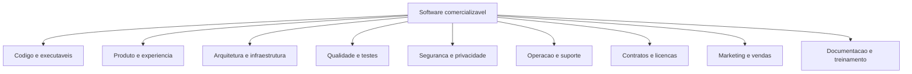

O software e um sistema sociotecnico: tecnologia, pessoas, processos, dados, contratos e operacao funcionam juntos.

---

# 2. Primeiro: Defina O Modelo De Comercializacao

Antes de preparar documentos, defina o que esta sendo vendido.

## 2.1 Desenvolvimento Sob Encomenda

O cliente contrata a criacao de uma solucao especifica.

Deve ficar claro:

- escopo;
- cronograma;
- preco;
- criterios de aceite;
- propriedade do codigo;
- manutencao;
- mudancas de escopo;
- responsabilidades.

## 2.2 Licenca De Uso

O fornecedor mantem a propriedade do software e autoriza o cliente a usa-lo conforme determinadas condicoes.

Exemplos:

- por usuario;
- por dispositivo;
- por unidade empresarial;
- por volume processado;
- perpetua;
- temporaria.

## 2.3 SaaS

**Software as a Service** e um modelo no qual o cliente acessa o software como servico, normalmente pela internet, e paga uma assinatura.

O fornecedor costuma administrar:

- hospedagem;
- atualizacoes;
- disponibilidade;
- seguranca da plataforma;
- backups;
- operacao.

## 2.4 White Label

O software e fornecido para outra empresa usar sua propria marca.

Devem ser definidos:

- elementos personalizaveis;
- limites da customizacao;
- dominios;
- identidade visual;
- suporte;
- atualizacoes;
- titularidade.

## 2.5 Transferencia Integral

O cliente recebe codigo, documentacao e direitos definidos no contrato, podendo assumir a manutencao.

Essa modalidade exige uma entrega tecnica especialmente completa.

## 2.6 Open Source Com Servicos

O codigo possui licenca aberta, enquanto a receita vem de:

- implementacao;
- suporte;
- hospedagem;
- treinamento;
- customizacao;
- funcionalidades comerciais.

---

# 3. Mapa Geral Dos Artefatos

Um **artefato** e qualquer documento, arquivo, modelo, evidencia ou pacote produzido durante o projeto.

| Area | Principais artefatos |
|---|---|
| Comercial | proposta, precificacao, apresentacao, ROI |
| Juridica | contrato, NDA, licenca, DPA, termos |
| Produto | visao, roadmap, PRD, backlog, metricas |
| Projeto | plano, cronograma, riscos, comunicacao |
| UX/UI | pesquisa, jornadas, fluxos, prototipos, design system |
| Arquitetura | diagramas, decisoes, integracoes, dados |
| Engenharia | codigo, repositorios, padroes, build |
| Qualidade | estrategia, casos, evidencias, aceite |
| Seguranca | ameacas, controles, testes, incidentes |
| DevOps | CI/CD, ambientes, infraestrutura como codigo |
| Operacao | runbooks, monitoramento, backup, DR |
| Suporte | SLA, canais, escalonamento, base de conhecimento |
| Marketing | posicionamento, marca, GTM, materiais |
| Entrega | inventario, release, treinamento, termo de aceite |

---

# 4. Documentos Comerciais

## 4.1 Apresentacao Executiva

E uma apresentacao curta para decisores.

Deve explicar:

1. problema;
2. impacto;
3. solucao;
4. diferenciais;
5. demonstracao;
6. beneficios;
7. investimento;
8. implantacao;
9. riscos e garantias;
10. proximo passo.

Evite apresentar apenas tecnologias. O cliente compra resultado, reducao de risco, eficiencia ou oportunidade.

## 4.2 One-Pager

Documento de uma pagina que resume:

- publico;
- problema;
- proposta de valor;
- funcionalidades;
- beneficios;
- diferenciais;
- forma de contratacao;
- contato.

## 4.3 Proposta Comercial

Documento formal que descreve a oferta.

Conteudo minimo:

- identificacao das partes;
- contexto;
- objetivo;
- escopo;
- entregaveis;
- exclusoes;
- premissas;
- cronograma;
- precos;
- impostos;
- forma de pagamento;
- validade da proposta;
- suporte;
- garantias;
- responsabilidades;
- condicoes de alteracao;
- aceite.

## 4.4 Business Case

Justifica economicamente a compra.

Pode incluir:

- problema atual;
- custo atual;
- riscos;
- ganhos esperados;
- investimento;
- retorno;
- alternativas;
- prazo de retorno.

### Exemplo De ROI

```text
ROI = (beneficio financeiro - investimento) / investimento
```

O calculo deve declarar premissas e nao prometer resultados sem base.

## 4.5 TCO

**Total Cost of Ownership** e o custo total de possuir e operar a solucao.

Inclua:

- licenca;
- implantacao;
- infraestrutura;
- integracoes;
- treinamento;
- suporte;
- manutencao;
- atualizacoes;
- migracao;
- encerramento.

## 4.6 Modelo De Precificacao

Documente:

- unidade cobrada;
- franquias;
- excedentes;
- reajustes;
- descontos;
- custo de implantacao;
- adicionais;
- renovacao;
- cancelamento.

---

# 5. Documentos Juridicos E De Governanca

## 5.1 NDA

**Non-Disclosure Agreement** e um acordo de confidencialidade.

Define:

- informacoes confidenciais;
- finalidade de uso;
- pessoas autorizadas;
- prazo;
- excecoes;
- devolucao ou destruicao;
- consequencias do descumprimento.

## 5.2 Contrato Principal

Deve refletir o modelo comercial.

Topicos comuns:

- objeto;
- escopo;
- valores;
- prazos;
- obrigacoes;
- propriedade intelectual;
- confidencialidade;
- protecao de dados;
- garantias;
- limitacoes de responsabilidade;
- suporte;
- rescisao;
- transicao;
- foro e legislacao.

## 5.3 SOW

**Statement of Work**, ou declaracao de trabalho, detalha uma execucao especifica.

Inclui:

- atividades;
- entregaveis;
- marcos;
- equipe;
- cronograma;
- dependencias;
- criterios de aceite.

## 5.4 MSA

**Master Services Agreement** e um contrato mestre que estabelece regras gerais para varias contratacoes.

Cada trabalho pode receber uma SOW propria.

## 5.5 SLA

**Service Level Agreement** define niveis de servico mensuraveis.

Exemplos:

- disponibilidade;
- prazo de resposta;
- prazo de restauracao;
- horario de suporte;
- severidade;
- compensacoes.

### Exemplo

| Severidade | Exemplo | Resposta | Atualizacao |
|---|---|---:|---:|
| P1 | sistema indisponivel | 30 min | a cada 60 min |
| P2 | funcao critica degradada | 2 h | a cada 4 h |
| P3 | problema com contorno | 1 dia util | diaria |
| P4 | duvida ou melhoria | 2 dias uteis | conforme planejamento |

## 5.6 Licenca De Software

Define:

- quem pode usar;
- onde;
- por quanto tempo;
- limites;
- copia;
- modificacao;
- redistribuicao;
- auditoria;
- encerramento.

## 5.7 Propriedade Intelectual

Esclareca:

- quem possui o codigo preexistente;
- quem possui o codigo novo;
- direitos sobre bibliotecas;
- componentes open source;
- marcas;
- documentacao;
- dados;
- modelos de IA;
- materiais criativos.

## 5.8 Protecao De Dados

Quando houver dados pessoais, documente:

- finalidade;
- base legal;
- categorias de dados;
- titulares;
- controlador e operador;
- compartilhamentos;
- retencao;
- direitos dos titulares;
- incidentes;
- transferencias;
- medidas de seguranca.

Um **DPA**, ou Data Processing Agreement, regula o tratamento de dados entre as partes.

## 5.9 Termos E Politicas

Conforme o produto:

- termos de uso;
- politica de privacidade;
- politica de cookies;
- politica de uso aceitavel;
- politica de seguranca;
- politica de retencao;
- aviso de IA.

---

# 6. Documentos De Produto

## 6.1 Visao Do Produto

Explica:

- para quem e;
- qual problema resolve;
- qual valor entrega;
- como se diferencia;
- qual futuro pretende construir.

### Template

```text
Para [publico]
que precisa [necessidade],
o [produto]
e uma [categoria]
que oferece [beneficio].
Diferentemente de [alternativa],
nossa solucao [diferencial].
```

## 6.2 Proposta De Valor

Relaciona:

- tarefas do cliente;
- dores;
- ganhos;
- produtos e servicos;
- alivios de dor;
- criadores de ganho.

## 6.3 PRD

**Product Requirements Document** descreve o que o produto precisa resolver e quais resultados deve produzir.

Conteudo:

- contexto;
- problema;
- objetivos;
- nao objetivos;
- usuarios;
- historias;
- requisitos;
- regras de negocio;
- metricas;
- riscos;
- dependencias;
- criterios de aceite.

## 6.4 Roadmap

Mostra a direcao de evolucao do produto.

Um roadmap nao deve ser confundido com promessa contratual, salvo quando incorporado ao contrato.

Pode ser organizado por:

- agora, depois e futuro;
- trimestres;
- objetivos;
- problemas;
- temas.

## 6.5 Backlog

Lista priorizada de:

- funcionalidades;
- melhorias;
- bugs;
- divida tecnica;
- pesquisas;
- seguranca.

Cada item deve ter contexto e criterio de conclusao.

## 6.6 Historias De Usuario

Formato:

```text
Como [tipo de usuario],
quero [acao],
para [beneficio].
```

Uma historia nao substitui especificacoes, fluxos ou regras complexas.

## 6.7 Criterios De Aceite

Condicoes objetivas para considerar um requisito atendido.

### Exemplo

```gherkin
Dado que o usuario possui uma conta ativa
Quando informar credenciais validas
Entao deve acessar o painel
E o evento deve ser registrado na auditoria
```

## 6.8 Regras De Negocio

Explicam politicas e calculos do dominio.

Exemplo:

```text
RB-014: pedidos acima de R$ 50.000 exigem aprovacao de dois gestores.
```

Use identificadores para rastreabilidade.

## 6.9 KPIs E Metricas

Defina:

- objetivo;
- indicador;
- formula;
- fonte;
- periodicidade;
- responsavel;
- meta;
- limites.

---

# 7. Plano Do Projeto

## 7.1 Project Charter

Documento de abertura que autoriza e enquadra o projeto.

Inclui:

- justificativa;
- objetivo;
- patrocinador;
- gerente;
- escopo inicial;
- marcos;
- recursos;
- riscos;
- autoridade.

## 7.2 Plano De Escopo

Defina:

- incluido;
- excluido;
- entregaveis;
- premissas;
- restricoes;
- processo de mudanca.

## 7.3 EAP

**Estrutura Analitica do Projeto** divide o trabalho em partes gerenciaveis.

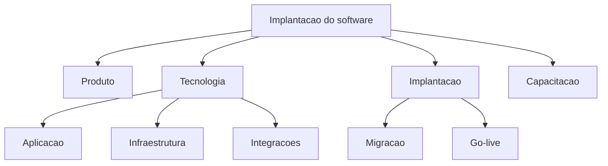

## 7.4 Cronograma

Inclua:

- atividades;
- duracao;
- dependencias;
- responsaveis;
- marcos;
- caminho critico;
- folgas.

## 7.5 Matriz RACI

Define participacao:

- **R**: executa;
- **A**: responde pelo resultado;
- **C**: consultado;
- **I**: informado.

| Atividade | Fornecedor | Cliente TI | Negocio | Juridico |
|---|---|---|---|---|
| Aprovar requisitos | R | C | A | I |
| Provisionar ambiente | C | A/R | I | I |
| Teste de aceite | C | C | A/R | I |
| Revisar contrato | C | I | C | A/R |

## 7.6 Plano De Comunicacao

Defina:

- publico;
- assunto;
- canal;
- frequencia;
- responsavel;
- registro.

## 7.7 Registro De Riscos

| Risco | Probabilidade | Impacto | Resposta | Responsavel |
|---|---:|---:|---|---|
| atraso da API externa | alta | alto | mock e escalonamento | arquitetura |
| dados inconsistentes | media | alto | saneamento e ensaio | cliente |

## 7.8 Gestao De Mudancas

Uma solicitacao de mudanca deve registrar:

- descricao;
- justificativa;
- impacto em escopo;
- custo;
- prazo;
- arquitetura;
- seguranca;
- aprovacao.

---

# 8. UX/UI E Design

## 8.1 Pesquisa

Entregaveis:

- plano de pesquisa;
- roteiro;
- consentimento;
- notas;
- sintese;
- oportunidades;
- evidencias.

## 8.2 Personas E Perfis

Representam grupos de usuarios e devem ser baseados em pesquisa ou claramente marcados como hipotese.

## 8.3 Jornada

Mostra etapas, acoes, dificuldades, emocoes e oportunidades.

## 8.4 Arquitetura Da Informacao

Documenta:

- mapa de navegacao;
- categorias;
- rotulos;
- busca;
- filtros;
- hierarquia.

## 8.5 Fluxos

Mostram decisoes e caminhos.

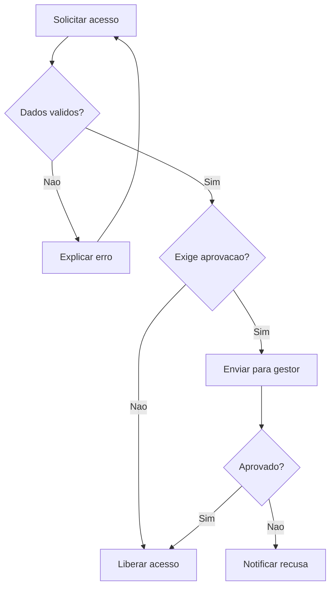

## 8.6 Wireframes E Prototipos

Entregue:

- arquivo editavel;
- versao aprovada;
- fluxos clicaveis;
- anotacoes;
- estados;
- responsividade;
- acessibilidade.

## 8.7 Design System

Inclua:

- principios;
- tokens;
- cores;
- tipografia;
- icones;
- componentes;
- estados;
- padroes;
- regras de conteudo;
- acessibilidade;
- implementacao em codigo.

## 8.8 Manual De Marca

Se a solucao criar ou utilizar uma marca:

- logotipo;
- versoes;
- paleta;
- tipografia;
- espacamento;
- usos proibidos;
- iconografia;
- fotografia;
- tom de voz;
- arquivos-fonte.

---

# 9. Requisitos Tecnicos E De Qualidade

## 9.1 Requisitos Funcionais

Descrevem comportamentos e servicos.

Exemplo:

```text
RF-021: o sistema deve permitir exportar o relatorio em CSV.
```

## 9.2 Requisitos Nao Funcionais

Descrevem qualidades e restricoes.

Categorias:

- desempenho;
- disponibilidade;
- seguranca;
- acessibilidade;
- compatibilidade;
- escalabilidade;
- observabilidade;
- manutencao;
- portabilidade;
- recuperacao.

### Exemplo Mensuravel

```text
RNF-008: 95% das requisicoes de consulta devem responder
em ate 500 ms, com 1.000 usuarios simultaneos.
```

Evite requisitos vagos como "o sistema deve ser rapido".

## 9.3 Matriz De Rastreabilidade

Liga:

```text
Necessidade -> requisito -> historia -> codigo -> teste -> evidencia
```

| Requisito | Historia | Componente | Teste | Status |
|---|---|---|---|---|
| RF-021 | US-38 | export-service | CT-104 | aprovado |

---

# 10. Documentacao De Arquitetura

## 10.1 Documento De Arquitetura

Explica como o sistema e estruturado e por que.

Pode seguir arc42 ou outro modelo.

Conteudo recomendado:

- objetivos;
- stakeholders;
- restricoes;
- contexto;
- estrategia;
- blocos;
- execucao;
- implantacao;
- conceitos transversais;
- decisoes;
- qualidade;
- riscos;
- glossario.

## 10.2 Modelo C4

O C4 organiza diagramas por nivel:

1. contexto;
2. containers;
3. componentes;
4. codigo, quando necessario.

### Contexto

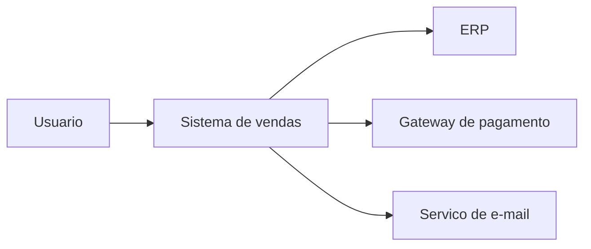

### Containers

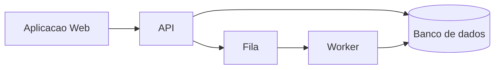

## 10.3 Diagramas De Sequencia

Explicam interacoes no tempo.

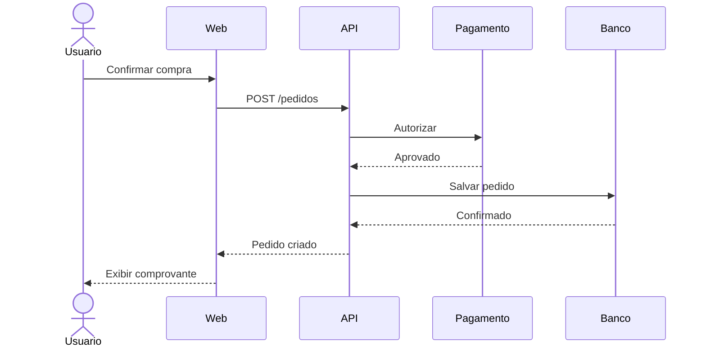

## 10.4 Modelo De Dados

Entregue:

- modelo conceitual;
- modelo logico;
- esquema fisico;
- dicionario de dados;
- chaves;
- restricoes;
- indices;
- retencao;
- classificacao.

## 10.5 ADR

**Architecture Decision Record** registra uma decisao arquitetural.

Template:

```text
Titulo
Status
Contexto
Decisao
Alternativas
Consequencias
Data
Responsaveis
```

Exemplo: escolher PostgreSQL em vez de banco documental.

## 10.6 Documentacao De APIs

Inclua:

- endpoints;
- metodos;
- autenticacao;
- schemas;
- exemplos;
- erros;
- limites;
- versionamento;
- webhooks;
- idempotencia.

OpenAPI permite descrever APIs HTTP em formato padronizado.

---

# 11. Repositorios

## 11.1 Principios

O repositorio deve permitir:

- encontrar codigo e documentos;
- reproduzir o build;
- testar;
- contribuir;
- auditar mudancas;
- gerar releases;
- recuperar historico.

## 11.2 Estrutura Sugerida Para Monorepo

```text
software-empresa/
|-- .github/
|   |-- workflows/
|   |-- ISSUE_TEMPLATE/
|   `-- pull_request_template.md
|-- apps/
|   |-- web/
|   |-- mobile/
|   `-- api/
|-- packages/
|   |-- ui/
|   |-- shared/
|   `-- config/
|-- infrastructure/
|   |-- terraform/
|   |-- kubernetes/
|   `-- scripts/
|-- database/
|   |-- migrations/
|   |-- seeds/
|   `-- docs/
|-- docs/
|   |-- architecture/
|   |-- product/
|   |-- operations/
|   |-- security/
|   `-- decisions/
|-- tests/
|   |-- integration/
|   |-- e2e/
|   `-- performance/
|-- tools/
|-- .editorconfig
|-- .gitignore
|-- CHANGELOG.md
|-- CODEOWNERS
|-- CONTRIBUTING.md
|-- LICENSE
|-- README.md
|-- SECURITY.md
`-- VERSION
```

## 11.3 Multirepo

Cada servico ou produto possui repositorio proprio.

Vantagens:

- permissoes separadas;
- ciclos independentes;
- repositorios menores.

Desafios:

- coordenacao;
- versionamento;
- descoberta;
- mudancas distribuidas.

## 11.4 README

Deve responder:

- o que e;
- como funciona;
- pre-requisitos;
- como instalar;
- como configurar;
- como executar;
- como testar;
- como publicar;
- onde obter ajuda.

## 11.5 CONTRIBUTING

Explica:

- fluxo Git;
- branches;
- commits;
- testes;
- revisao;
- estilo;
- seguranca;
- processo de contribuicao.

## 11.6 CODEOWNERS

Define revisores responsaveis por areas do repositorio.

## 11.7 SECURITY

Explica como relatar vulnerabilidades sem expo-las publicamente.

## 11.8 Segredos

Nunca entregue segredos reais no repositorio:

- senhas;
- tokens;
- chaves;
- certificados privados;
- credenciais de banco.

Entregue modelos:

```text
.env.example
```

As credenciais reais devem estar em cofre seguro.

## 11.9 Historico Git

Antes da transferencia:

- remova segredos do historico;
- revise autores;
- marque a versao;
- crie release;
- confirme permissoes;
- transfira propriedade;
- preserve auditoria.

---

# 12. Documentacao Do Codigo E Build

## 12.1 Padroes De Codigo

Documente:

- formatacao;
- nomes;
- estrutura;
- erros;
- logs;
- testes;
- dependencias;
- revisao.

## 12.2 Build Reproduzivel

Outra equipe deve conseguir gerar o produto a partir do repositorio.

Inclua:

- versoes;
- dependencias;
- comandos;
- variaveis;
- artefatos;
- checksums;
- assinatura;
- troubleshooting.

## 12.3 Dependencias

Entregue:

- arquivos de lock;
- lista de dependencias;
- versoes;
- licencas;
- vulnerabilidades conhecidas;
- politica de atualizacao.

## 12.4 SBOM

**Software Bill of Materials** e o inventario dos componentes usados no software.

Pode incluir:

- nome;
- versao;
- fornecedor;
- hash;
- licenca;
- dependencia;
- identificador.

## 12.5 Versionamento Semantico

Formato:

```text
MAJOR.MINOR.PATCH
```

- MAJOR: mudanca incompativel;
- MINOR: funcionalidade compativel;
- PATCH: correcao compativel.

## 12.6 Changelog

Registra mudancas relevantes por versao:

- adicionado;
- alterado;
- corrigido;
- removido;
- seguranca;
- descontinuado.

---

# 13. Qualidade E Testes

## 13.1 Estrategia De Testes

Define:

- escopo;
- niveis;
- ambientes;
- dados;
- ferramentas;
- criterios de entrada;
- criterios de saida;
- responsabilidades;
- evidencias.

## 13.2 Tipos

| Tipo | Objetivo |
|---|---|
| Unitario | validar unidade isolada |
| Integracao | validar componentes juntos |
| Contrato | validar interfaces entre servicos |
| Sistema | validar produto completo |
| E2E | validar jornada real |
| Regressao | evitar retorno de defeitos |
| Performance | medir carga, estresse e estabilidade |
| Seguranca | identificar vulnerabilidades |
| Usabilidade | observar uso por pessoas |
| Acessibilidade | avaliar uso inclusivo |
| Compatibilidade | validar dispositivos e navegadores |
| UAT | aceite pelos usuarios ou cliente |

## 13.3 Plano E Casos De Teste

Cada caso pode conter:

- identificador;
- requisito;
- pre-condicao;
- dados;
- passos;
- resultado esperado;
- resultado obtido;
- evidencia;
- status.

## 13.4 Relatorio De Qualidade

Inclua:

- cobertura;
- testes executados;
- aprovados;
- falhas;
- defeitos;
- severidades;
- riscos aceitos;
- recomendacao.

## 13.5 Testes De Performance

Documente:

- cenario;
- volume;
- concorrencia;
- ambiente;
- duracao;
- percentis;
- gargalos;
- conclusao.

## 13.6 UAT

**User Acceptance Testing** e o teste de aceite realizado sob a perspectiva do negocio.

O cliente valida se o sistema atende ao uso contratado.

---

# 14. Seguranca

## 14.1 Plano De Seguranca

Inclua seguranca desde requisitos ate operacao.

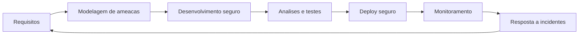

## 14.2 Modelagem De Ameacas

Identifica:

- ativos;
- agentes;
- fronteiras de confianca;
- ameacas;
- impactos;
- controles.

## 14.3 Controles

- autenticacao;
- autorizacao;
- criptografia;
- gestao de sessao;
- validacao de entrada;
- logs;
- auditoria;
- gestao de segredos;
- atualizacao;
- backup;
- isolamento.

## 14.4 Evidencias De Seguranca

- SAST;
- DAST;
- analise de dependencias;
- scan de containers;
- teste de invasao;
- revisao de configuracao;
- remediacao;
- aceite de risco.

## 14.5 ASVS

O OWASP ASVS fornece requisitos para verificacao de controles tecnicos de seguranca de aplicacoes e pode ser usado em desenvolvimento e contratacao.

## 14.6 Plano De Resposta A Incidentes

Defina:

- deteccao;
- classificacao;
- contatos;
- contencao;
- erradicacao;
- recuperacao;
- comunicacao;
- evidencias;
- retrospectiva.

## 14.7 Politica De Vulnerabilidades

Inclua:

- canal;
- triagem;
- severidade;
- prazo;
- correcao;
- divulgacao;
- atualizacao.

---

# 15. Infraestrutura E DevOps

## 15.1 Ambientes

Normalmente:

- desenvolvimento;
- teste;
- homologacao;
- producao;
- recuperacao.

Documente diferencas e acesso.

## 15.2 Diagrama De Implantacao

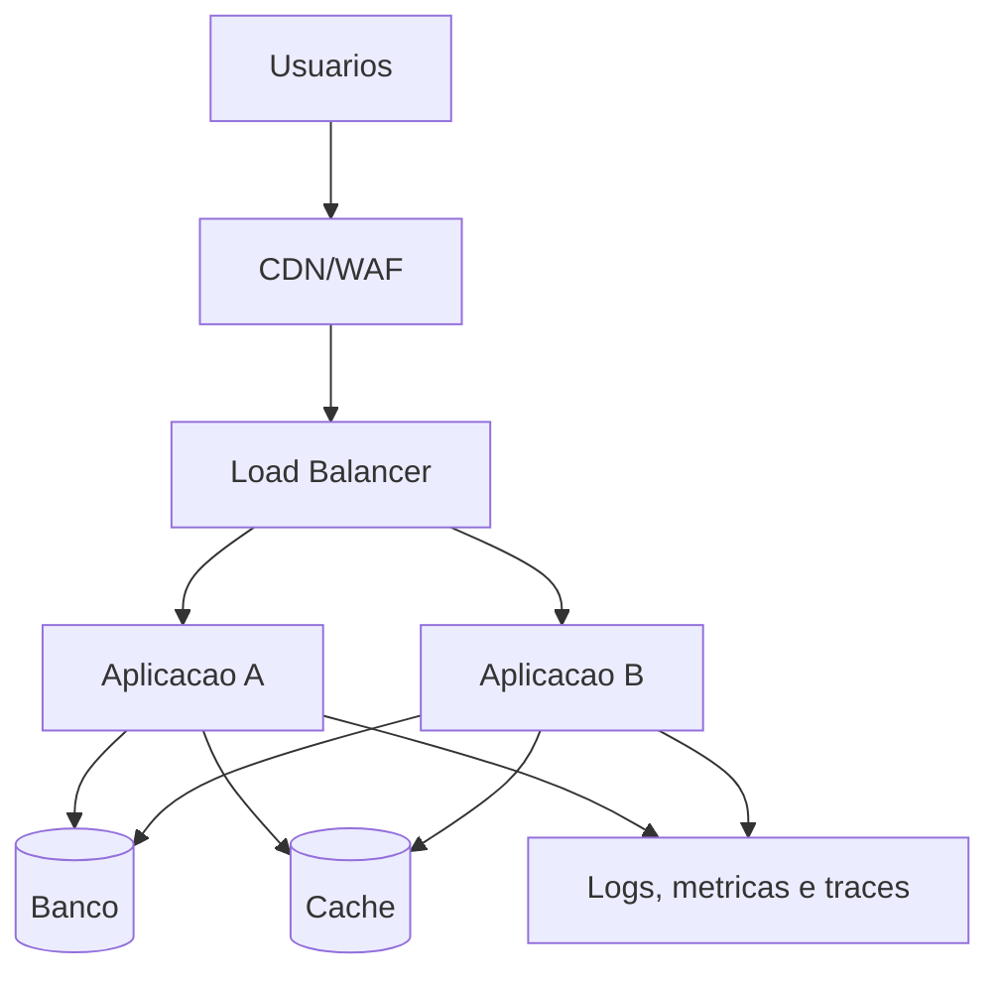

## 15.3 Infraestrutura Como Codigo

Infraestrutura como codigo descreve recursos em arquivos versionados.

Beneficios:

- repetibilidade;
- auditoria;
- revisao;
- automacao;
- recuperacao.

## 15.4 CI/CD

**CI**, integracao continua, valida mudancas frequentemente.

**CD** pode significar entrega ou implantacao continua.

Pipeline:

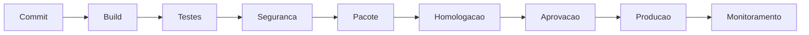

## 15.5 Estrategia De Deploy

- rolling;
- blue-green;
- canary;
- feature flags;
- janela controlada.

## 15.6 Plano De Rollback

Explique:

- gatilhos;
- responsavel;
- versao anterior;
- banco;
- compatibilidade;
- validacao;
- comunicacao.

---

# 16. Dados E Migracao

## 16.1 Plano De Migracao

Inclua:

- origem;
- destino;
- mapeamento;
- limpeza;
- transformacao;
- validacao;
- ensaio;
- corte;
- reconciliacao;
- rollback.

## 16.2 Dicionario De Dados

Para cada campo:

- nome;
- significado;
- tipo;
- formato;
- obrigatoriedade;
- origem;
- classificacao;
- retencao;
- regra.

## 16.3 Qualidade De Dados

Avalie:

- completude;
- validade;
- consistencia;
- unicidade;
- atualidade;
- precisao.

## 16.4 Propriedade E Governanca

Defina:

- proprietario;
- custodiante;
- acesso;
- compartilhamento;
- retencao;
- exclusao;
- backup;
- auditoria.

---

# 17. Operacao E Observabilidade

## 17.1 Manual De Operacao

Explica:

- iniciar;
- parar;
- verificar;
- atualizar;
- recuperar;
- escalar;
- manter.

## 17.2 Runbook

Runbook e um procedimento operacional executavel.

Exemplo:

```text
Alerta: fila acima de 10.000 mensagens
1. Confirmar metrica.
2. Verificar workers.
3. Consultar logs.
4. Aumentar capacidade conforme limite.
5. Escalar se persistir por 15 minutos.
6. Registrar incidente.
```

## 17.3 Observabilidade

Baseia-se em:

- logs;
- metricas;
- traces;
- eventos.

## 17.4 SLI, SLO E SLA

- **SLI**: indicador medido;
- **SLO**: objetivo interno;
- **SLA**: compromisso contratual.

Exemplo:

```text
SLI: percentual de requisicoes bem-sucedidas.
SLO: 99,95% ao mes.
SLA: 99,9% ao mes.
```

## 17.5 Alertas

Um alerta deve ser:

- acionavel;
- priorizado;
- associado a runbook;
- testado;
- sem excesso de ruido.

---

# 18. Continuidade, Backup E Recuperacao

## 18.1 Backup

Documente:

- dados cobertos;
- frequencia;
- retencao;
- criptografia;
- local;
- responsavel;
- testes de restauracao.

## 18.2 RPO

**Recovery Point Objective** e a perda maxima de dados aceitavel, medida em tempo.

Exemplo:

```text
RPO de 15 minutos: pode-se perder no maximo 15 minutos de dados.
```

## 18.3 RTO

**Recovery Time Objective** e o tempo maximo para restaurar o servico.

## 18.4 Disaster Recovery

Plano para recuperar o servico apos desastre.

Inclua:

- cenarios;
- papeis;
- infraestrutura;
- dados;
- comunicacao;
- testes;
- retorno.

## 18.5 BCP

**Business Continuity Plan** e mais amplo: mantem processos essenciais da organizacao durante interrupcoes.

---

# 19. Suporte E Sustentacao

## 19.1 Modelo De Suporte

Defina:

- canais;
- horarios;
- idiomas;
- severidades;
- prazos;
- escalonamento;
- responsabilidades.

## 19.2 Niveis

- N1: atendimento inicial;
- N2: analise funcional ou tecnica;
- N3: engenharia especializada.

## 19.3 Base De Conhecimento

Inclua:

- perguntas frequentes;
- tutoriais;
- erros conhecidos;
- procedimentos;
- videos;
- busca.

## 19.4 Manutencao

Tipos:

- corretiva;
- adaptativa;
- evolutiva;
- preventiva.

## 19.5 Fim De Vida

Defina:

- versoes suportadas;
- prazo de aviso;
- migracao;
- exportacao;
- encerramento;
- eliminacao dos dados.

---

# 20. Treinamento E Transferencia De Conhecimento

## 20.1 Publicos

- usuarios finais;
- administradores;
- suporte;
- desenvolvimento;
- seguranca;
- gestores.

## 20.2 Materiais

- manual do usuario;
- guia rapido;
- manual administrativo;
- videos;
- apresentacoes;
- laboratorio;
- FAQ;
- gravacao;
- exercicios.

## 20.3 Handover Tecnico

**Handover** e a transferencia estruturada de conhecimento e responsabilidade.

Agenda:

1. visao do produto;
2. arquitetura;
3. repositorios;
4. build;
5. deploy;
6. dados;
7. seguranca;
8. observabilidade;
9. incidentes;
10. backlog e riscos.

## 20.4 Shadowing E Reverse Shadowing

- shadowing: nova equipe observa a equipe atual;
- reverse shadowing: nova equipe executa e a equipe atual supervisiona.

---

# 21. Marketing E Go-To-Market

## 21.1 Plano De Marketing

Deve definir:

- mercado;
- publico;
- posicionamento;
- mensagem;
- canais;
- conteudo;
- campanhas;
- orcamento;
- metricas.

## 21.2 ICP

**Ideal Customer Profile** descreve a empresa com maior aderencia a solucao.

Exemplo:

- setor;
- porte;
- maturidade;
- problema;
- tecnologia;
- orcamento;
- processo de compra.

## 21.3 Buyer Persona

Representa a pessoa envolvida na compra:

- usuario;
- influenciador;
- decisor;
- comprador;
- aprovador tecnico.

## 21.4 Posicionamento

Explica qual espaco a solucao deseja ocupar na mente do cliente.

## 21.5 Mensagens

Prepare mensagens por publico:

- diretoria: resultado e risco;
- TI: arquitetura e integracao;
- seguranca: controles e evidencias;
- usuario: facilidade e beneficio;
- financeiro: custo e retorno.

## 21.6 Materiais De Venda

- site;
- landing page;
- deck;
- ficha tecnica;
- video;
- demo;
- caso de uso;
- estudo de caso;
- FAQ;
- comparativo;
- calculadora de ROI;
- proposta.

## 21.7 Go-To-Market

GTM e o plano para levar o produto ao mercado.

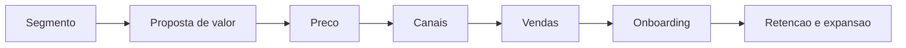

## 21.8 Plano De Lancamento

Inclua:

- data;
- publico;
- versao;
- comunicacao;
- capacitacao;
- suporte reforcado;
- monitoramento;
- rollback;
- avaliacao.

---

# 22. Demonstracao Para O Cliente

## 22.1 Roteiro

1. retome o problema;
2. apresente o cenario;
3. execute a jornada principal;
4. mostre ganhos;
5. demonstre integracoes;
6. explique seguranca;
7. mostre operacao;
8. apresente proximos passos.

## 22.2 Ambiente De Demo

Deve ter:

- dados ficticios;
- estabilidade;
- roteiro ensaiado;
- contas prontas;
- plano alternativo;
- privacidade;
- desempenho.

## 22.3 Prova De Conceito

Uma POC valida viabilidade ou risco especifico. Nao deve ser confundida com produto pronto.

Defina:

- hipotese;
- escopo;
- prazo;
- dados;
- criterio de sucesso;
- descarte ou evolucao.

---

# 23. Implantacao

## 23.1 Plano De Implantacao

Inclua:

- escopo da versao;
- ambiente;
- pre-requisitos;
- responsaveis;
- sequencia;
- verificacoes;
- comunicacao;
- suporte;
- rollback.

## 23.2 Checklist De Go-Live

- [ ] escopo aprovado;
- [ ] testes concluidos;
- [ ] UAT aprovado;
- [ ] seguranca aprovada;
- [ ] backup realizado;
- [ ] rollback testado;
- [ ] monitoramento ativo;
- [ ] suporte escalado;
- [ ] usuarios comunicados;
- [ ] documentacao publicada;
- [ ] responsaveis de plantao confirmados.

## 23.3 Hypercare

Periodo de acompanhamento intensivo apos o lancamento.

Defina:

- duracao;
- equipe;
- canais;
- metricas;
- reunioes;
- criterios de encerramento.

---

# 24. Aceite E Encerramento

## 24.1 Termo De Aceite

Documento pelo qual o cliente reconhece que entregaveis atendem aos criterios.

Inclua:

- contrato;
- versao;
- entregaveis;
- testes;
- pendencias;
- excecoes;
- data;
- assinaturas.

## 24.2 Aceite Com Ressalvas

Pode registrar pendencias que nao impedem o uso, com:

- responsavel;
- prazo;
- impacto;
- plano.

## 24.3 Relatorio Final

Inclua:

- objetivos;
- escopo entregue;
- marcos;
- custos;
- indicadores;
- qualidade;
- riscos;
- pendencias;
- licoes;
- recomendacoes.

## 24.4 Licoes Aprendidas

Registre:

- o que funcionou;
- o que falhou;
- por que;
- o que repetir;
- o que mudar.

---

# 25. Pacote De Entrega

## 25.1 Estrutura Sugerida

```text
entrega-software-v1.0.0/
|-- 00_indice/
|   |-- inventario_entrega.md
|   `-- contatos.md
|-- 01_comercial_juridico/
|   |-- contrato.pdf
|   |-- sow.pdf
|   |-- sla.pdf
|   `-- licencas.xlsx
|-- 02_produto/
|   |-- visao_produto.md
|   |-- prd.pdf
|   |-- roadmap.pdf
|   `-- backlog_exportado.csv
|-- 03_ux_ui/
|   |-- fluxos/
|   |-- prototipos/
|   |-- design_system/
|   `-- manual_marca.pdf
|-- 04_arquitetura/
|   |-- arquitetura.pdf
|   |-- diagramas/
|   |-- adr/
|   |-- dados/
|   `-- apis/
|-- 05_codigo_build/
|   |-- repositorios.md
|   |-- build.md
|   |-- sbom/
|   `-- checksums.txt
|-- 06_qualidade/
|   |-- estrategia_testes.pdf
|   |-- evidencias/
|   `-- relatorio_final.pdf
|-- 07_seguranca/
|   |-- modelo_ameacas.pdf
|   |-- relatorio_testes.pdf
|   `-- riscos_residuais.pdf
|-- 08_infra_devops/
|   |-- ambientes.md
|   |-- pipelines.md
|   |-- infraestrutura/
|   `-- deploy_rollback.md
|-- 09_operacao/
|   |-- runbooks/
|   |-- monitoramento.md
|   |-- backup_dr.md
|   `-- incidentes.md
|-- 10_suporte_treinamento/
|   |-- manual_usuario.pdf
|   |-- manual_admin.pdf
|   |-- treinamento/
|   `-- suporte_sla.md
`-- 11_aceite/
    |-- release_notes.md
    |-- pendencias.md
    `-- termo_aceite.pdf
```

## 25.2 Inventario De Entrega

Tabela central:

| Item | Versao | Formato | Local | Responsavel | Status |
|---|---|---|---|---|---|
| Codigo API | 1.0.0 | Git | repositorio X | fornecedor | entregue |
| Manual | 1.0 | PDF | pasta 10 | produto | aprovado |

## 25.3 Checksums

Checksum e um valor calculado a partir de um arquivo para verificar integridade.

---

# 26. Pacote Minimo Por Tipo De Entrega

## 26.1 Projeto Pequeno

- contrato;
- escopo;
- README;
- codigo;
- instalacao;
- manual;
- testes principais;
- licencas;
- backup;
- aceite.

## 26.2 SaaS B2B

- contrato e DPA;
- SLA;
- arquitetura;
- seguranca;
- APIs;
- onboarding;
- operacao;
- suporte;
- continuidade;
- metricas;
- exit plan.

## 26.3 Sistema Corporativo Sob Encomenda

- PRD;
- regras;
- rastreabilidade;
- UX/UI;
- arquitetura;
- repositorios;
- CI/CD;
- testes;
- migracao;
- treinamento;
- handover;
- aceite.

## 26.4 Sistema Critico

Exige maior rigor:

- analise de risco;
- requisitos formais;
- seguranca;
- redundancia;
- testes de falha;
- auditoria;
- continuidade;
- evidencias;
- certificacoes aplicaveis;
- plano de incidentes.

---

# 27. Matriz De Responsabilidades Da Entrega

| Artefato | Produto | UX | Engenharia | DevOps | Seguranca | Juridico | Cliente |
|---|---|---|---|---|---|---|---|
| PRD | A/R | C | C | I | C | I | C |
| Prototipo | C | A/R | C | I | C | I | C |
| Arquitetura | C | C | A/R | C | C | I | C |
| Pipeline | I | I | C | A/R | C | I | C |
| Contrato | C | I | C | I | C | A/R | C |
| UAT | C | C | C | I | I | I | A/R |
| Handover | C | C | R | R | C | I | A |

---

# 28. Reuniao Final De Entrega

## Agenda Recomendada

1. objetivo e escopo;
2. versao entregue;
3. demonstracao;
4. arquitetura;
5. seguranca;
6. testes;
7. ambientes;
8. operacao;
9. suporte;
10. documentacao;
11. riscos residuais;
12. pendencias;
13. aceite;
14. proximos passos.

## Participantes

- patrocinador;
- dono do produto;
- TI;
- seguranca;
- operacao;
- suporte;
- juridico, quando necessario;
- fornecedor.

---

# 29. Perguntas Que O Cliente Pode Fazer

## Produto

- Qual problema resolve?
- Para quem?
- O que nao faz?
- Como evolui?

## Tecnologia

- Onde roda?
- Como integra?
- Como escala?
- Como e atualizado?

## Seguranca

- Como protege dados?
- Como trata vulnerabilidades?
- Houve teste de invasao?
- Como notifica incidente?

## Operacao

- Qual disponibilidade?
- Como restaurar?
- Quem monitora?
- O que acontece se o fornecedor encerrar?

## Comercial

- Qual custo total?
- Como reajusta?
- O que e adicional?
- Como cancelar?

Prepare respostas documentadas, nao improvisadas.

---

# 30. Checklist Mestre

## Comercial E Juridico

- [ ] modelo comercial definido;
- [ ] proposta aprovada;
- [ ] contrato assinado;
- [ ] escopo e exclusoes claros;
- [ ] propriedade intelectual definida;
- [ ] licencas revisadas;
- [ ] protecao de dados tratada;
- [ ] SLA definido.

## Produto

- [ ] visao;
- [ ] PRD;
- [ ] backlog;
- [ ] regras;
- [ ] metricas;
- [ ] criterios de aceite.

## UX/UI

- [ ] fluxos;
- [ ] prototipos;
- [ ] estados;
- [ ] acessibilidade;
- [ ] design system;
- [ ] arquivos editaveis.

## Arquitetura E Dados

- [ ] contexto;
- [ ] containers;
- [ ] componentes;
- [ ] implantacao;
- [ ] ADRs;
- [ ] APIs;
- [ ] modelo e dicionario de dados.

## Codigo

- [ ] repositorios transferidos;
- [ ] README;
- [ ] build reproduzivel;
- [ ] dependencias travadas;
- [ ] SBOM;
- [ ] sem segredos;
- [ ] release marcada.

## Qualidade E Seguranca

- [ ] testes;
- [ ] evidencias;
- [ ] UAT;
- [ ] performance;
- [ ] acessibilidade;
- [ ] scans;
- [ ] riscos residuais aceitos.

## Infraestrutura E Operacao

- [ ] ambientes;
- [ ] pipeline;
- [ ] deploy;
- [ ] rollback;
- [ ] monitoramento;
- [ ] runbooks;
- [ ] backup;
- [ ] DR.

## Pessoas E Transicao

- [ ] usuarios treinados;
- [ ] administradores treinados;
- [ ] suporte treinado;
- [ ] handover concluido;
- [ ] contatos atualizados;
- [ ] hypercare definido.

## Aceite

- [ ] inventario conferido;
- [ ] pendencias registradas;
- [ ] termo assinado;
- [ ] pagamentos e marcos conferidos;
- [ ] proxima fase definida.

---

# 31. Glossario

| Termo | Explicacao |
|---|---|
| ADR | registro de uma decisao arquitetural e suas consequencias |
| API | interface pela qual sistemas trocam dados ou comandos |
| Artefato | documento, arquivo, modelo, pacote ou evidencia do projeto |
| Backlog | lista priorizada de trabalhos |
| BCP | plano para manter atividades essenciais durante interrupcoes |
| Build | processo de transformar codigo em artefato executavel |
| Canary | implantacao gradual para pequena parcela |
| CI/CD | automacao de integracao, entrega e implantacao |
| C4 | modelo de diagramacao de arquitetura em niveis |
| DAST | teste dinamico de seguranca na aplicacao executando |
| DPA | acordo sobre tratamento de dados pessoais |
| DR | recuperacao de desastre |
| E2E | teste de uma jornada de ponta a ponta |
| EAP | decomposicao hierarquica do trabalho |
| Feature flag | controle para ativar funcionalidade sem novo deploy |
| Go-live | entrada oficial em producao |
| GTM | estrategia de entrada no mercado |
| Handover | transferencia de conhecimento e responsabilidade |
| Hypercare | suporte intensivo imediatamente apos lancamento |
| IaC | infraestrutura definida e versionada como codigo |
| ICP | perfil de empresa cliente ideal |
| KPI | indicador-chave de desempenho |
| LGPD | lei brasileira sobre protecao de dados pessoais |
| MSA | contrato mestre de servicos |
| NDA | acordo de confidencialidade |
| OpenAPI | especificacao para descrever APIs HTTP |
| POC | prova limitada para validar viabilidade |
| PRD | documento de requisitos de produto |
| RACI | matriz de responsabilidades |
| Release | versao preparada e publicada |
| RNF | requisito nao funcional |
| Rollback | retorno a estado ou versao anterior |
| RPO | perda maxima aceitavel de dados medida em tempo |
| RTO | tempo maximo aceitavel para restauracao |
| Runbook | procedimento operacional passo a passo |
| SaaS | software oferecido como servico |
| SAST | analise estatica de seguranca do codigo |
| SBOM | inventario de componentes do software |
| SDLC | ciclo de vida do desenvolvimento de software |
| SLA | compromisso contratual de nivel de servico |
| SLI | indicador usado para medir o servico |
| SLO | objetivo interno de nivel de servico |
| SOW | declaracao detalhada de trabalho |
| TCO | custo total de propriedade |
| UAT | teste de aceite do usuario ou negocio |
| White label | produto fornecido para uso com a marca do cliente |

---

# 32. Referencias Oficiais E Tecnicas

- [OWASP Application Security Verification Standard](https://owasp.org/www-project-application-security-verification-standard/)
- [NIST Secure Software Development Framework](https://csrc.nist.gov/Projects/ssdf)
- [ISO/IEC 25010 - Qualidade de sistemas e software](https://www.iso.org/standard/35733.html)
- [GitHub - Boas praticas para repositorios](https://docs.github.com/en/repositories/creating-and-managing-repositories/best-practices-for-repositories)
- [Semantic Versioning](https://semver.org/)
- [arc42 - Documentacao de arquitetura](https://arc42.org/overview)
- [C4 Model](https://c4model.com/)
- [OpenAPI Initiative](https://www.openapis.org/)
- [OWASP Top 10](https://owasp.org/www-project-top-ten/)
- [WCAG - Acessibilidade](https://www.w3.org/WAI/standards-guidelines/wcag/)
- [Lei Geral de Protecao de Dados](https://www.gov.br/anpd/pt-br/assuntos/legislacao/lgpd)

---

# Conclusao

Uma entrega profissional precisa responder a cinco perguntas:

```text
1. O que foi comprado?
2. Como foi construido?
3. Como sabemos que funciona e e seguro?
4. Como sera operado e mantido?
5. Quem responde por cada parte?
```

O cliente nao deve receber apenas codigo. Deve receber capacidade de compreender, usar, operar, auditar, manter e evoluir o produto dentro dos limites contratados.

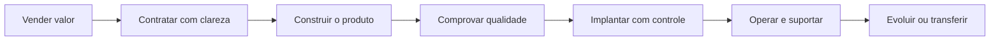
