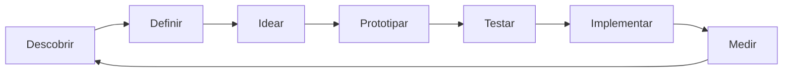
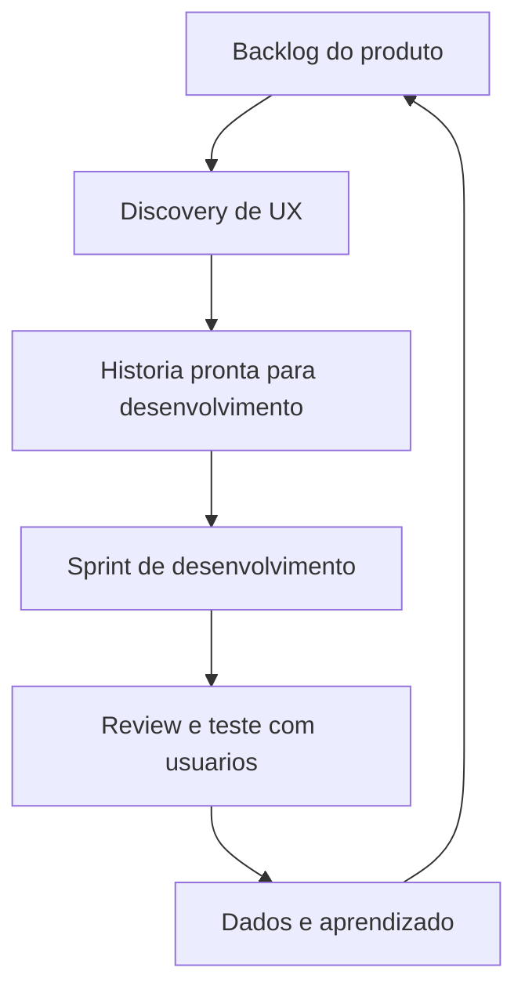
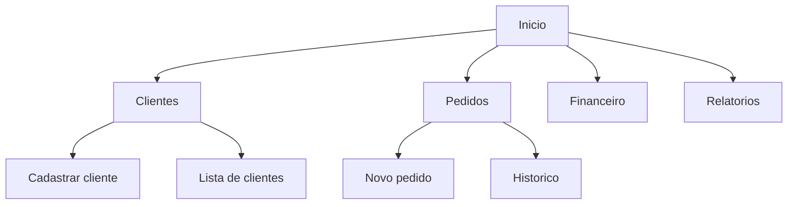
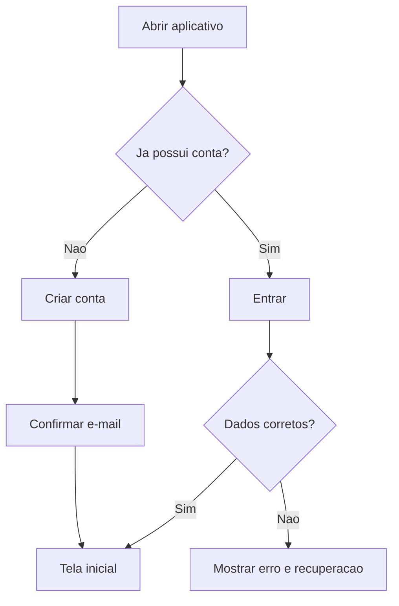
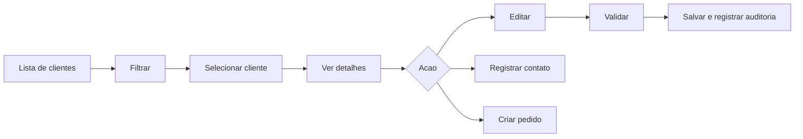

# Aula Completa De UX/UI Para Jogos, Sistemas, Software E Mobile

## Experiencia do usuario, interfaces, CX, dashboards, design systems, marca e SDLC

> Material didatico para estudo, aula expositiva, oficina pratica e consulta posterior.

---

## Sumario

1. Objetivos da aula
2. Conceitos fundamentais
3. UX, UI, usabilidade, acessibilidade e CX
4. Processo de UX
5. UX/UI no ciclo de desenvolvimento de software
6. Pesquisa com usuarios
7. Arquitetura da informacao
8. Jornadas, fluxos e prototipos
9. Principios de Nielsen
10. Design visual e hierarquia
11. UX/UI para sistemas corporativos
12. UX/UI para dashboards
13. UX/UI para dispositivos moveis
14. UX/UI para jogos
15. Acessibilidade
16. Material Design
17. Design System do Governo Federal
18. Design systems, componentes e integracao
19. Marca e identidade visual
20. Brand experience e imagem corporativa
21. UX cross-cultural
22. Ferramentas de UX/UI
23. Metricas e avaliacao
24. Erros frequentes
25. Oficina pratica
26. Projeto final
27. Checklist
28. Glossario
29. Links e referencias

---

# 1. Objetivos Da Aula

Ao final desta aula, o aluno devera ser capaz de:

- diferenciar UX, UI, usabilidade, acessibilidade, CX e branding;
- compreender como o design centrado no usuario participa do SDLC;
- planejar uma pesquisa basica com usuarios;
- criar personas, jornadas, fluxos, wireframes e prototipos;
- aplicar as 10 heuristicas de Nielsen;
- projetar interfaces para web, sistemas, dashboards, mobile e jogos;
- reconhecer a importancia de acessibilidade e inclusao;
- compreender Material Design e Design System do Governo Federal;
- organizar componentes, tokens e documentacao de um design system;
- conectar identidade visual, marca e experiencia;
- considerar diferencas culturais no projeto;
- avaliar uma interface por dados quantitativos e qualitativos.

---

# 2. Conceitos Fundamentais

## 2.1 O Que E Design?

Design nao e apenas fazer algo bonito.

Design e o processo de planejar uma solucao para uma necessidade, considerando:

- pessoas;
- contexto;
- objetivos;
- restricoes;
- tecnologia;
- negocio;
- seguranca;
- acessibilidade;
- manutencao.

Uma interface bonita que nao permite concluir a tarefa e uma interface mal projetada.

## 2.2 O Que E UX?

**UX** significa **User Experience**, ou experiencia do usuario.

UX representa a experiencia completa de uma pessoa ao interagir com um produto, servico ou organizacao.

Essa experiencia inclui:

- facilidade de aprender;
- facilidade de usar;
- tempo para realizar uma tarefa;
- confianca;
- emocao;
- percepcao de qualidade;
- acessibilidade;
- recuperacao de erros;
- satisfacao antes, durante e depois do uso.

### Exemplo

Em um aplicativo bancario, UX envolve:

- facilidade para instalar;
- clareza no cadastro;
- seguranca percebida;
- rapidez para consultar saldo;
- facilidade para fazer uma transferencia;
- mensagem apresentada quando ocorre um erro;
- ajuda oferecida;
- atendimento posterior.

## 2.3 O Que E UI?

**UI** significa **User Interface**, ou interface do usuario.

UI e a camada visual e interativa por meio da qual a pessoa utiliza o sistema.

Inclui:

- botoes;
- menus;
- campos;
- icones;
- cores;
- tipografia;
- espacamentos;
- imagens;
- animacoes;
- sons;
- estados;
- mensagens;
- componentes.

### Formula Didatica

```text
UX = experiencia completa
UI = meio visual e interativo
```

Uma UI pode ser bonita e ainda produzir uma UX ruim.

---

# 3. UX, UI, Usabilidade, Acessibilidade E CX

## 3.1 Relacao Entre Os Conceitos


    CX["CX: experiencia com a organizacao"]
    UX["UX: experiencia com o produto ou servico"]
    UI["UI: interface visual e interativa"]
    US["Usabilidade: eficacia, eficiencia e satisfacao"]
    AC["Acessibilidade: uso por pessoas com diferentes capacidades"]
    BR["Brand Experience: experiencia percebida da marca"]

    CX --> UX
    CX --> BR
    UX --> UI
    UX --> US
    UX --> AC
    UI --> BR
```

## 3.2 Usabilidade

Usabilidade observa se uma pessoa consegue usar um produto:

- com eficacia;
- com eficiencia;
- com poucos erros;
- com facilidade de aprendizado;
- com satisfacao.

### Exemplo

Uma tela de pagamento pode ter boa usabilidade quando:

- os campos sao claros;
- o valor e conferido antes da confirmacao;
- os erros sao explicados;
- existe opcao de voltar;
- o comprovante aparece ao final.

## 3.3 Acessibilidade

Acessibilidade procura garantir que pessoas com diferentes capacidades consigam perceber, compreender, navegar e operar o produto.

Exemplos de necessidades:

- deficiencia visual;
- baixa visao;
- daltonismo;
- deficiencia auditiva;
- limitacoes motoras;
- deficiencias cognitivas;
- uso temporario com uma mao;
- ambiente com muito ruido;
- tela sob luz solar;
- conexao lenta.

## 3.4 Customer Experience

**CX**, ou Customer Experience, e a experiencia do cliente com toda a organizacao.

Ela inclui:

- publicidade;
- vendas;
- contratacao;
- uso do produto;
- cobranca;
- suporte;
- cancelamento;
- pos-venda;
- comunicacao;
- reputacao.

### Diferenca Entre UX E CX

| Situacao | UX | CX |
|---|---:|---:|
| Encontrar uma funcao no aplicativo | Sim | Parte da CX |
| Receber atendimento pelo telefone | Pode nao envolver produto | Sim |
| Entender um formulario | Sim | Parte da CX |
| Confiar na empresa | Influencia | Sim |
| Cancelar uma assinatura | UX do fluxo | CX completa |

---

# 4. Processo De UX

UX e um processo continuo, nao uma etapa isolada.

## 4.1 Fluxo Geral



## 4.2 Descobrir

Perguntas:

- Quem sao os usuarios?
- O que eles tentam fazer?
- Qual problema enfrentam?
- Em qual contexto usam o produto?
- Quais solucoes usam atualmente?
- Quais sao suas limitacoes?

Entregaveis:

- entrevistas;
- pesquisa documental;
- benchmark;
- observacao;
- dados de uso;
- mapa de stakeholders.

## 4.3 Definir

O objetivo e transformar informacoes em um problema claro.

Exemplo:

```text
Usuarios iniciantes abandonam o cadastro porque nao entendem
quais documentos devem enviar e nao recebem retorno sobre o envio.
```

## 4.4 Idear

Gerar alternativas antes de escolher uma solucao.

Tecnicas:

- brainstorming;
- Crazy 8s;
- mapa mental;
- co-criacao;
- sketching;
- analise de analogias;
- "Como poderiamos...?".

## 4.5 Prototipar

Construir uma representacao da solucao.

Niveis:

| Fidelidade | Caracteristica | Uso |
|---|---|---|
| Baixa | papel, caixas e textos | explorar ideias |
| Media | wireframe digital | validar estrutura e fluxo |
| Alta | visual proximo do produto | validar interacao e aparencia |
| Funcional | codigo ou motor real | validar comportamento e desempenho |

### 4.5.1 - Diferença de Wireframe - Mockup - Protótipo

1. Wireframe (Esqueleto)O que é: Um rascunho em preto e branco que define a estrutura e o layout.Foco: Hierarquia das informações, navegação e usabilidade básica. Não usa cores reais ou imagens.Objetivo: Decidir rapidamente onde os botões e textos ficarão, economizando tempo antes de gastar com design visual.


3. Mockup (Aparência)O que é: Uma representação estática do design final.Foco: Identidade visual, incluindo cores, tipografia, ícones e imagens.Objetivo: Mostrar exatamente como o produto vai ficar visualmente para aprovação, mas não é clicável.


5. Protótipo (Simulação)O que é: Um modelo altamente realista e interativo do produto.Foco: Simular a experiência real do usuário (UX).Objetivo: Testar se os menus funcionam, se a transição entre telas faz sentido e coletar feedback antes de programar de fato


6. Draft: Na engenharia de software, o termo draft (que em português significa rascunho ou esboço) refere-se à versão inicial, provisória ou incompleta de um código, design de sistema ou documentação. O objetivo principal do draft é estruturar as ideias iniciais para validação, revisão ou testes antes da versão final ir para produção.

6.1 Principais usos no desenvolvimento de softwareDraft de Código (Code Draft): Uma versão preliminar de uma funcionalidade. Geralmente é criada rapidamente para testar se uma lógica funciona ou para compartilhar com a equipe em um pull request (PR) inicial, mesmo que não esteja totalmente otimizada ou com todos os tratamentos de erro.

6.2 Design ou Arquitetura Draft: Diagramas de arquitetura, fluxogramas ou modelos de banco de dados iniciais. Servem para discutir a estrutura do sistema com outros desenvolvedores e stakeholders antes da implementação real.Documentação e Especificação (Draft Specs): Documentos como RFCs (Request for Comments) ou especificações técnicas informais que detalham como um software deve funcionar, permitindo que a equipe colabore e refine os requisitos.

6.3 Diferença entre "Draft" e "Protótipo"Embora sejam próximos, na prática eles têm propósitos diferentes:
    
    Draft (Esboço): Focado em documentar ou estruturar o raciocínio. Pode ser alterado facilmente e não costuma ser funcional por si só.
    
    Protótipo: Focado em experimentação funcional. É geralmente um código interativo ou uma tela clicável criada para validar uma ideia de negócio ou testar a usabilidade com usuários      reais.


## 4.6 Testar

Observar pessoas tentando realizar tarefas.

Nao se pergunta apenas:

> Voce gostou?

Pede-se:

> Imagine que voce precisa cadastrar um novo cliente. Mostre como faria.

## 4.7 Medir E Evoluir

Depois da entrega, analisar:

- uso real;
- erros;
- abandono;
- conversao;
- tempo de tarefa;
- chamados;
- satisfacao;
- acessibilidade;
- desempenho.

---

# 5. UX/UI No SDLC

## 5.1 O Que E SDLC?

SDLC significa **Software Development Life Cycle**, ou ciclo de vida do desenvolvimento de software.

Um modelo simplificado:


UX/UI deve participar de todas essas etapas.

## 5.2 Antes Do Desenvolvimento

Atividades:

- pesquisa com usuarios;
- definicao do problema;
- analise da jornada;
- requisitos de experiencia;
- arquitetura da informacao;
- fluxos;
- wireframes;
- prototipos;
- teste de conceito;
- criterios de acessibilidade;
- alinhamento com a marca.

### Beneficio

Corrigir um fluxo em um desenho costuma ser mais barato do que corrigir o sistema depois de implementado.

## 5.3 Durante O Desenvolvimento

Atividades:

- detalhar componentes;
- documentar estados;
- esclarecer comportamento responsivo;
- acompanhar implementacao;
- revisar acessibilidade;
- validar textos;
- testar versoes intermediarias;
- manter comunicacao entre design e desenvolvimento;
- atualizar design system.

## 5.4 Depois Do Desenvolvimento

Atividades:

- testes de usabilidade;
- analise de metricas;
- entrevistas;
- avaliacao heuristica;
- testes A/B;
- revisao de acessibilidade;
- analise de suporte;
- melhoria continua;
- atualizacao da documentacao.

## 5.5 Integracao Com Metodos Ageis



UX nao deve estar muitas sprints distante do desenvolvimento nem trabalhar apenas depois que tudo estiver pronto.

---

# 6. Pesquisa Com Usuarios

## 6.1 Pesquisa Qualitativa

Ajuda a descobrir:

- por que algo acontece;
- como as pessoas pensam;
- quais dificuldades possuem;
- quais necessidades ainda nao foram atendidas.

Metodos:

- entrevista;
- observacao;
- teste de usabilidade;
- diario de uso;
- estudo de campo;
- grupo focal;
- contextual inquiry.

## 6.2 Pesquisa Quantitativa

Ajuda a medir:

- quantas pessoas fazem algo;
- qual etapa possui maior abandono;
- quanto tempo uma tarefa demora;
- qual versao tem melhor resultado.

Metodos:

- analytics;
- questionarios;
- testes A/B;
- funis;
- logs;
- telemetria;
- heatmaps;
- indicadores.

## 6.3 Roteiro Basico De Entrevista

```text
1. Apresentacao e consentimento.
2. Contexto do participante.
3. Como realiza a tarefa atualmente.
4. Dificuldades e estrategias.
5. Ferramentas utilizadas.
6. Situacoes recentes e concretas.
7. Expectativas.
8. Encerramento.
```

Evite perguntas que induzam respostas:

```text
Ruim: Voce nao acha este botao confuso?
Melhor: O que voce espera que aconteca ao selecionar este botao?
```

---

# 7. Arquitetura Da Informacao

Arquitetura da informacao organiza conteudo e funcionalidades para que as pessoas consigam:

- encontrar;
- compreender;
- navegar;
- decidir;
- concluir tarefas.

## 7.1 Elementos

- hierarquia;
- categorias;
- navegacao;
- rotulos;
- busca;
- filtros;
- metadados;
- relacionamentos.

## 7.2 Exemplo



## 7.3 Card Sorting

Participantes agrupam itens segundo seu entendimento.

Pode ser:

- aberto: participantes criam categorias;
- fechado: categorias ja existem;
- hibrido: categorias existem, mas podem ser criadas novas.

---

# 8. Jornadas, Fluxos E Prototipos

## 8.1 Jornada Do Usuario

Representa a experiencia ao longo do tempo.

| Etapa | Acao | Pensamento | Emocao | Problema | Oportunidade |
|---|---|---|---|---|---|
| Descoberta | procura solucao | "Sera confiavel?" | curiosidade | pouca informacao | demonstrar credibilidade |
| Cadastro | informa dados | "Por que pedem isto?" | receio | formulario longo | explicar e dividir etapas |
| Primeiro uso | testa recurso | "Onde comeco?" | inseguranca | tela vazia | onboarding contextual |
| Suporte | procura ajuda | "Preciso resolver agora" | frustracao | busca ruim | ajuda contextual |

## 8.2 User Flow



## 8.3 Wireframe

Wireframe e um esqueleto da interface.

```text
+--------------------------------------------------+
| Logo                       Busca       Perfil    |
+------------------+-------------------------------+
| Menu             | Titulo da pagina              |
| - Inicio         |                               |
| - Clientes       | [ Filtro ] [ Novo cliente ]  |
| - Relatorios     |                               |
|                  | Tabela de dados               |
|                  |                               |
+------------------+-------------------------------+
```

O wireframe prioriza estrutura e funcao, nao decoracao.

---

# 9. As 10 Heuristicas De Nielsen

As heuristicas sao principios gerais usados para avaliar interfaces. Elas nao substituem testes com usuarios, mas ajudam a identificar problemas.

## 9.1 Visibilidade Do Estado Do Sistema

O sistema deve informar o que esta acontecendo.

Exemplos:

- indicador de carregamento;
- progresso de upload;
- confirmacao de salvamento;
- estado selecionado;
- turno atual em um jogo.

### Ruim

O usuario seleciona "Enviar" e nada muda.

### Melhor

```text
Enviando documento... 65%
```

## 9.2 Correspondencia Entre Sistema E Mundo Real

Use linguagem, ordem e conceitos familiares ao publico.

Exemplos:

- "Carrinho" em comercio;
- "Lixeira" para itens removidos;
- linguagem do setor no sistema corporativo;
- mapa, inventario e missao em jogos.

Evite mostrar termos internos como:

```text
Erro FK_CONTRACT_002
```

## 9.3 Controle E Liberdade

Permita:

- voltar;
- cancelar;
- desfazer;
- refazer;
- sair;
- corrigir.

Em jogos:

- remapear controles;
- pausar;
- voltar ao menu;
- cancelar uma compra;
- confirmar exclusao de progresso.

## 9.4 Consistencia E Padroes

O mesmo elemento deve manter significado e comportamento.

Exemplo:

```text
Botao vermelho = acao destrutiva
Botao primario = principal acao da tela
Icone de lupa = busca
```

Consistencia pode ser:

- interna: dentro do produto;
- externa: com convencoes da plataforma;
- de marca: entre produtos da organizacao.

## 9.5 Prevencao De Erros

O melhor erro e aquele que o design impede.

Exemplos:

- mascara de CPF;
- limite de caracteres;
- bloquear data impossivel;
- desabilitar acao sem requisitos;
- confirmar acao irreversivel;
- mostrar alcance de um ataque antes de executa-lo.

## 9.6 Reconhecimento Em Vez De Memorizacao

Nao obrigue o usuario a guardar informacoes na memoria.

Exemplos:

- historico recente;
- sugestoes;
- rotulos visiveis;
- comandos exibidos quando necessarios;
- inventario com icones e descricoes;
- ajuda contextual.

## 9.7 Flexibilidade E Eficiencia

Atenda iniciantes e especialistas.

Exemplos:

- atalhos de teclado;
- comandos rapidos;
- favoritos;
- acoes em lote;
- personalizacao;
- configuracao de sensibilidade;
- remapeamento de controles.

## 9.8 Design Estetico E Minimalista

Mostre o necessario para a tarefa.

Minimalismo nao significa remover informacao importante.

Em dashboards:

- destaque indicadores decisivos;
- reduza decoracao;
- use cores com funcao;
- evite graficos sem pergunta clara.

Em jogos:

- HUD deve apoiar o jogo;
- informacao critica deve ser legivel;
- elementos podem desaparecer quando nao sao necessarios.

## 9.9 Reconhecer, Diagnosticar E Recuperar Erros

Uma boa mensagem responde:

1. O que aconteceu?
2. Por que aconteceu?
3. Como corrigir?

### Exemplo

```text
Nao foi possivel enviar o arquivo.
O tamanho maximo permitido e 10 MB.
Escolha um arquivo menor e tente novamente.
```

## 9.10 Ajuda E Documentacao

A ajuda deve ser:

- facil de encontrar;
- orientada a tarefa;
- curta;
- contextual;
- pesquisavel;
- atualizada.

Em jogos:

- tutorial interativo;
- codex;
- dicas opcionais;
- pratica de controles;
- explicacao de habilidades.

---

# 10. Design Visual E Hierarquia

## 10.1 Hierarquia Visual

Hierarquia mostra o que deve ser percebido primeiro.

Recursos:

- tamanho;
- contraste;
- posicao;
- espaco;
- peso tipografico;
- cor;
- agrupamento;
- movimento.

## 10.2 Principios De Gestalt

### Proximidade

Elementos proximos parecem pertencer ao mesmo grupo.

### Similaridade

Elementos parecidos parecem ter a mesma funcao.

### Continuidade

O olhar tende a seguir linhas e direcoes.

### Fechamento

O cerebro completa formas incompletas.

### Figura E Fundo

Deve ser claro o que e conteudo principal e o que e fundo.

## 10.3 Tipografia

Verifique:

- legibilidade;
- tamanho;
- altura de linha;
- contraste;
- quantidade de familias;
- hierarquia;
- numeros tabulares em dashboards;
- suporte a idiomas.

## 10.4 Cor

Cor deve comunicar, nao apenas decorar.

Nao use somente cor para transmitir estado.

```text
Incorreto: campo errado indicado apenas em vermelho.
Melhor: vermelho + icone + mensagem textual.
```

---

# 11. UX/UI Para Sistemas Corporativos

Sistemas corporativos, ERPs, CRMs e ferramentas operacionais exigem:

- velocidade;
- clareza;
- previsibilidade;
- densidade informacional controlada;
- atalhos;
- filtros;
- auditoria;
- permissoes;
- prevencao de erros;
- suporte a tarefas repetitivas.

## 11.1 Caracteristicas

| Necessidade | Solucao de design |
|---|---|
| muitas informacoes | hierarquia, filtros e visualizacao configuravel |
| uso diario | atalhos, memoria de preferencias |
| operacoes criticas | confirmacao e trilha de auditoria |
| perfis diferentes | permissoes e interfaces por funcao |
| aprendizado | ajuda contextual e padroes consistentes |
| tarefas em lote | selecao multipla e acoes coletivas |

## 11.2 Exemplo De Fluxo



---

# 12. UX/UI Para Dashboards

## 12.1 O Que E Um Dashboard?

Dashboard e uma interface que organiza indicadores e informacoes para apoiar acompanhamento, analise ou decisao.

Um dashboard nao deve ser apenas uma colecao de graficos.

Ele precisa responder perguntas.

## 12.2 Tipos

| Tipo | Objetivo | Atualizacao |
|---|---|---|
| Estrategico | acompanhar objetivos e KPIs | semanal, mensal |
| Tatico | orientar gestao de areas | diaria, semanal |
| Operacional | acompanhar operacao imediata | tempo real ou frequente |
| Analitico | explorar causas e relacoes | sob demanda |

## 12.3 Fluxo De Criacao


## 12.4 Escolha De Graficos

| Pergunta | Visual mais comum |
|---|---|
| Evolucao no tempo | linha |
| Comparacao entre categorias | barras |
| Parte de um total | barra empilhada; pizza apenas em casos simples |
| Distribuicao | histograma ou boxplot |
| Relacao entre variaveis | dispersao |
| Localizacao geografica | mapa, quando geografia for relevante |
| Valor unico prioritario | KPI com contexto e meta |

## 12.5 Erros Em Dashboards

- graficos 3D;
- muitas cores;
- ausencia de unidade;
- eixo truncado sem justificativa;
- KPI sem meta ou comparacao;
- excesso de cards;
- informacoes sem prioridade;
- filtros escondidos;
- atualizacao dos dados nao informada;
- baixa acessibilidade;
- tabela ilegivel no mobile.

---

# 13. UX/UI Para Mobile

## 13.1 Restricoes E Oportunidades

Mobile possui:

- tela menor;
- toque;
- uso em movimento;
- interrupcoes;
- orientacao vertical e horizontal;
- sensores;
- camera;
- biometria;
- conectividade variavel;
- diferentes tamanhos de tela.

## 13.2 Principios

- priorizar tarefas;
- reduzir digitacao;
- usar componentes nativos quando apropriado;
- oferecer alvos de toque confortaveis;
- considerar alcance do polegar;
- manter feedback imediato;
- salvar progresso;
- projetar estados offline e de conexao lenta;
- respeitar permissoes e privacidade;
- testar em aparelhos reais.

## 13.3 Fluxo Mobile


## 13.4 Estados Que Devem Ser Projetados

- vazio;
- carregando;
- sucesso;
- erro;
- sem internet;
- sem permissao;
- sem resultado;
- conteudo parcial;
- sessao expirada;
- atualizacao obrigatoria.

---

# 14. UX/UI Para Jogos

UX em jogos nao procura apenas tornar tudo facil. O jogo pode ser intencionalmente desafiador.

A diferenca importante e:

```text
Desafio do jogo = intencional
Confusao da interface = geralmente indesejada
```

## 14.1 Camadas Da Experiencia

- onboarding;
- menus;
- HUD;
- controles;
- feedback;
- dificuldade;
- progressao;
- economia;
- narrativa;
- acessibilidade;
- multiplayer;
- loja;
- salvamento;
- suporte.

## 14.2 HUD

HUD significa **Head-Up Display**.

Pode mostrar:

- vida;
- energia;
- municao;
- mapa;
- objetivo;
- tempo;
- habilidades;
- pontuacao;
- status de equipe.

O HUD deve equilibrar:

- informacao;
- imersao;
- legibilidade;
- carga cognitiva.

## 14.3 Loop De Jogo


## 14.4 Feedback Em Jogos

Uma acao pode produzir:

- animacao;
- som;
- vibracao;
- alteracao de cor;
- numero;
- movimento de camera;
- particulas;
- mudanca no estado do mundo.

O feedback precisa ser proporcional e compreensivel.

## 14.5 Onboarding

Um bom onboarding:

- ensina quando a habilidade e necessaria;
- permite praticar;
- nao apresenta tudo de uma vez;
- usa demonstracao e acao;
- pode ser repetido;
- considera jogadores experientes.

## 14.6 Controles

Verifique:

- consistencia;
- latencia;
- remapeamento;
- sensibilidade;
- suporte a teclado, mouse, controle e toque;
- indicacao correta dos botoes;
- alternativas para comandos complexos;
- vibracao configuravel.

## 14.7 UX De Jogo Mobile

Cuidados:

- dedos cobrem a tela;
- controles virtuais precisam ser ajustaveis;
- sessoes podem ser curtas;
- bateria e desempenho importam;
- notificacoes devem respeitar o jogador;
- compras precisam ser transparentes;
- nao manipular criancas ou pessoas vulneraveis.

---

# 15. Acessibilidade

## 15.1 Principios POUR Da WCAG

```text
P - Perceptivel
O - Operavel
U - Compreensivel
R - Robusto
```

## 15.2 Perceptivel

- alternativas textuais;
- contraste;
- legendas;
- audiodescricao quando aplicavel;
- conteudo adaptavel;
- nao depender somente de cor.

## 15.3 Operavel

- navegacao por teclado;
- foco visivel;
- tempo suficiente;
- evitar conteudo que provoque crises;
- alvos de interacao adequados.

## 15.4 Compreensivel

- linguagem clara;
- navegacao consistente;
- identificacao e correcao de erros;
- instrucoes compreensiveis.

## 15.5 Robusto

- estrutura semantica;
- compatibilidade com tecnologias assistivas;
- componentes com nome, funcao e estado identificaveis.

## 15.6 Acessibilidade Em Jogos

Recursos:

- legendas configuraveis;
- tamanho de texto;
- contraste;
- modos para daltonismo;
- remapeamento;
- reducao de movimento;
- assistencia de mira;
- dificuldade ajustavel;
- indicacoes visuais para sons;
- narracao de menus;
- alternativas a comandos repetitivos;
- ajuste de velocidade.

---

# 16. Material Design

Material Design e um sistema de design mantido pelo Google.

Ele oferece orientacoes para:

- cor;
- tipografia;
- forma;
- movimento;
- layout;
- componentes;
- acessibilidade;
- adaptacao a diferentes telas.

## 16.1 Material Design 3

Conceitos importantes:

- design tokens;
- temas;
- cores dinamicas;
- componentes reutilizaveis;
- estados;
- layouts adaptativos;
- acessibilidade;
- personalizacao.

## 16.2 Componentes

Exemplos:

- buttons;
- cards;
- dialogs;
- navigation bars;
- navigation drawers;
- text fields;
- chips;
- snackbars;
- tabs;
- switches;
- date pickers.

## 16.3 Quando Usar

Material Design e especialmente util quando:

- o produto precisa de padroes consolidados;
- existe aplicacao Android;
- a equipe quer acelerar componentes;
- e necessario manter consistencia;
- ha multiplos produtos.

Ele nao obriga todo produto a parecer igual ao Google. Tokens, tema e marca devem adaptar o sistema.

---

# 17. Design System Do Governo Federal

O **Padrao Digital de Governo**, frequentemente chamado de Design System do Governo Federal ou DSGov, orienta a construcao de servicos digitais governamentais consistentes.

Ele ajuda a padronizar:

- identidade;
- componentes;
- comportamento;
- acessibilidade;
- linguagem;
- navegacao;
- servicos publicos digitais.

## 17.1 Por Que E Importante?

Servicos publicos precisam atender uma populacao ampla, com:

- diferentes idades;
- diferentes niveis de escolaridade;
- diferentes dispositivos;
- diferentes capacidades;
- diferentes niveis de conectividade.

## 17.2 Uso Responsavel

Antes de usar:

- consulte a documentacao atual;
- verifique componentes oficiais;
- respeite regras de marca do Governo Federal;
- valide acessibilidade;
- nao copie apenas a aparencia;
- implemente comportamento e semantica corretamente.

Link oficial:

[Design System do Governo Federal](https://www.gov.br/ds/home)

---

# 18. Design Systems, Componentes E Integracao

## 18.1 O Que E Um Design System?

Design system e um conjunto organizado de:

- principios;
- tokens;
- componentes;
- padroes;
- regras;
- documentacao;
- ferramentas;
- governanca.

Nao e apenas uma biblioteca de botoes.

## 18.2 Camadas


## 18.3 Design Tokens

Tokens representam decisoes de design em formato reutilizavel.

Exemplo:

```json
{
  "color.brand.primary": "#0050B3",
  "color.feedback.error": "#B42318",
  "space.sm": "8px",
  "space.md": "16px",
  "radius.control": "4px",
  "font.body.size": "16px"
}
```

## 18.4 Anatomia De Um Componente

Um botao deve documentar:

- finalidade;
- anatomia;
- variantes;
- tamanhos;
- estados;
- acessibilidade;
- conteudo;
- comportamento;
- exemplos;
- codigo.

Estados:

```text
Default
Hover
Focus
Pressed
Disabled
Loading
Success
Error, quando aplicavel
```

## 18.5 Integracao Design E Codigo


## 18.6 Governanca

Definir:

- quem pode propor componente;
- quem aprova;
- como testar;
- como versionar;
- como comunicar mudancas;
- como descontinuar;
- como medir adocao;
- como tratar contribuicoes.

---

# 19. Marca E Identidade Visual

## 19.1 O Que E Marca?

Marca nao e apenas o logotipo.

Marca e o conjunto de percepcoes, significados, expectativas e memorias associados a uma organizacao, produto ou servico.

## 19.2 Identidade Visual

E o sistema visual que representa a marca.

Inclui:

- logotipo;
- simbolo;
- cores;
- tipografia;
- fotografia;
- ilustracao;
- icones;
- composicao;
- movimento;
- grafismos;
- tom visual.

## 19.3 Manual Da Marca

Pode documentar:

- proposito;
- posicionamento;
- personalidade;
- logotipo;
- area de protecao;
- tamanho minimo;
- versoes;
- usos incorretos;
- paleta;
- tipografia;
- fotografia;
- iconografia;
- tom de voz;
- aplicacoes;
- acessibilidade;
- co-branding.

## 19.4 Identidade Visual E UX

A identidade nao pode prejudicar:

- contraste;
- legibilidade;
- hierarquia;
- acessibilidade;
- convencoes da plataforma;
- entendimento dos estados.

Uma cor da marca pode ser ajustada ou complementada para funcionar em interfaces.

---

# 20. Brand Experience E Imagem Corporativa

## 20.1 Brand Experience

Brand experience e a experiencia sensorial, emocional, funcional e simbolica que uma pessoa tem com a marca.

Ela ocorre em:

- produto;
- interface;
- atendimento;
- loja;
- embalagem;
- publicidade;
- comunicacao;
- suporte;
- redes sociais;
- eventos.

## 20.2 Imagem Corporativa

Imagem corporativa e como a organizacao e percebida pelos publicos.

Ela e influenciada por:

- comportamento;
- qualidade;
- transparencia;
- seguranca;
- comunicacao;
- responsabilidade;
- experiencia;
- consistencia.

## 20.3 Relacao Entre Marca E Produto


Se a marca promete simplicidade, mas o sistema e confuso, existe uma ruptura de experiencia.

---

# 21. UX Cross-Cultural

UX cross-cultural considera que pessoas de diferentes culturas podem interpretar de modo diferente:

- cores;
- simbolos;
- gestos;
- imagens;
- humor;
- hierarquia;
- privacidade;
- datas;
- numeros;
- moedas;
- nomes;
- enderecos;
- textos;
- formas de pagamento.

## 21.1 Internacionalizacao E Localizacao

**Internacionalizacao**, ou i18n:

Preparar o produto tecnicamente para diferentes idiomas e regioes.

**Localizacao**, ou l10n:

Adaptar o produto para uma cultura ou mercado especifico.

## 21.2 Exemplos

- datas: `11/06/2026` pode ser interpretada de formas distintas;
- separador decimal: `1.500,50` ou `1,500.50`;
- leitura da direita para a esquerda;
- textos traduzidos podem ocupar mais espaco;
- nomes podem nao seguir "nome e sobrenome";
- cores podem ter associacoes diferentes;
- icones e gestos podem ser ofensivos em determinadas culturas.

## 21.3 Checklist Cross-Cultural

- idioma;
- direcao de leitura;
- expansao de texto;
- fonte e caracteres;
- data e hora;
- moeda;
- unidades;
- endereco;
- telefone;
- documentos;
- imagens;
- simbolos;
- pagamentos;
- leis;
- privacidade;
- testes locais.

---

# 22. Ferramentas De UX/UI

## 22.1 Pesquisa E Descoberta

| Ferramenta | Uso |
|---|---|
| FigJam | workshops, mapas e jornadas |
| Miro | colaboracao e diagramas |
| Dovetail | repositorio e analise de pesquisa |
| Forms | questionarios |
| Notion | documentacao |

## 22.2 Wireframe E Prototipacao

| Ferramenta | Uso |
|---|---|
| Figma | UI, prototipos, componentes e colaboracao |
| Penpot | design e prototipacao open source |
| Sketch | design de interfaces no macOS |
| Axure RP | prototipos complexos e regras |
| Balsamiq | wireframes de baixa fidelidade |

## 22.3 Jogos

| Ferramenta | Uso |
|---|---|
| Unity | prototipos e interfaces em jogos |
| Unreal Engine | UMG, prototipos e jogos |
| Godot | jogos e interfaces |
| Figma | fluxos, HUD e menus |
| Blender | elementos 3D |

## 22.4 Desenvolvimento E Handoff

| Ferramenta | Uso |
|---|---|
| Storybook | documentacao de componentes |
| Git | versionamento |
| Dev Mode | especificacoes de design |
| Tokens Studio | design tokens |
| Zeplin | handoff e documentacao |

## 22.5 Teste E Analise

| Ferramenta | Uso |
|---|---|
| Maze | testes remotos de prototipos |
| Lookback | pesquisa moderada |
| Hotjar | mapas e gravacoes, conforme privacidade |
| Google Analytics | comportamento e funis |
| Lighthouse | desempenho e verificacoes web |
| axe | avaliacao automatizada de acessibilidade |

Ferramentas apoiam o processo, mas nao substituem metodo, pesquisa e pensamento critico.

---

# 23. Metricas E Avaliacao

## 23.1 Metricas De Usabilidade

- taxa de conclusao;
- tempo na tarefa;
- numero de erros;
- pedidos de ajuda;
- sucesso na primeira tentativa;
- facilidade percebida.

## 23.2 Metricas De Experiencia

- SUS;
- CSAT;
- CES;
- NPS, quando adequado;
- retencao;
- abandono;
- engajamento;
- reclamacoes;
- retorno ao produto.

## 23.3 Metricas Em Jogos

- conclusao do tutorial;
- abandono por fase;
- tempo de sessao;
- retencao D1, D7 e D30;
- taxa de falha;
- uso de habilidades;
- alteracoes de configuracao;
- dificuldade percebida;
- funil de compra;
- comportamento por dispositivo.

## 23.4 Avaliacao Heuristica

Passos:

1. definir tarefas e escopo;
2. selecionar avaliadores;
3. inspecionar individualmente;
4. registrar problemas;
5. relacionar com heuristicas;
6. classificar gravidade;
7. consolidar;
8. priorizar correcoes.

Escala sugerida:

| Gravidade | Significado |
|---:|---|
| 0 | nao e problema |
| 1 | cosmetico |
| 2 | pequeno |
| 3 | grave |
| 4 | catastrofico ou bloqueador |

---

# 24. Erros Frequentes

1. comecar pela tela antes de entender o problema;
2. projetar para si mesmo;
3. confundir preferencia com evidencia;
4. testar apenas no final;
5. ignorar estados de erro;
6. nao considerar acessibilidade;
7. copiar tendencias sem contexto;
8. usar cor sem significado;
9. criar componentes inconsistentes;
10. ignorar textos;
11. nao validar em dispositivos reais;
12. usar dashboard sem pergunta;
13. confundir desafio com confusao em jogos;
14. ignorar desempenho;
15. nao medir depois do lancamento;
16. usar personas inventadas sem pesquisa;
17. tratar design system como arquivo estatico;
18. deixar marca prejudicar usabilidade;
19. esquecer diferencas culturais;
20. nao incluir desenvolvimento, produto e negocio no processo.

---

# 25. Oficina Pratica

## Atividade 1 - Avaliacao Heuristica

Escolha:

- um aplicativo;
- um sistema academico;
- um jogo;
- um site institucional.

Encontre pelo menos cinco problemas.

Registre:

| Tela | Problema | Heuristica | Gravidade | Recomendacao |
|---|---|---|---:|---|
| Login | erro sem explicacao | Recuperacao de erros | 3 | informar causa e solucao |

## Atividade 2 - Redesenho

Redesenhe uma tela considerando:

- objetivo principal;
- hierarquia;
- estado normal;
- carregamento;
- vazio;
- erro;
- sucesso;
- acessibilidade;
- mobile e desktop.

## Atividade 3 - Jogo

Projete um HUD para um jogo.

Defina:

- genero;
- plataforma;
- publico;
- informacoes criticas;
- momentos de exibicao;
- feedback;
- acessibilidade;
- controles.

## Atividade 4 - Dashboard

Crie um dashboard para responder:

> A operacao esta dentro da meta e onde esta o principal problema?

Inclua:

- ate cinco KPIs;
- comparacao;
- tendencia;
- filtro;
- data de atualizacao;
- acao possivel.

---

# 26. Projeto Final

## Desafio

Criar a proposta de UX/UI para um dos seguintes produtos:

1. aplicativo de atendimento publico;
2. sistema corporativo de chamados;
3. jogo educacional mobile;
4. dashboard de desempenho academico.

## Entregaveis

- problema;
- publico;
- hipotese;
- roteiro de pesquisa;
- persona ou proto-persona identificada como hipotese;
- jornada;
- fluxo;
- wireframe;
- prototipo;
- componentes;
- criterios de acessibilidade;
- aplicacao da marca;
- teste com pelo menos tres participantes;
- relatorio de melhorias.

## Criterios De Avaliacao

| Criterio | Peso |
|---|---:|
| entendimento do problema | 15% |
| qualidade do fluxo | 15% |
| usabilidade | 15% |
| acessibilidade | 15% |
| consistencia visual | 10% |
| componentes | 10% |
| teste e evidencias | 15% |
| apresentacao | 5% |

---

# 27. Checklist Geral

## Pesquisa

- [ ] O problema foi validado?
- [ ] Usuarios reais foram ouvidos?
- [ ] O contexto de uso foi considerado?
- [ ] Dados qualitativos e quantitativos foram analisados?

## Fluxo

- [ ] A tarefa principal esta clara?
- [ ] O fluxo possui saida e recuperacao?
- [ ] Existem etapas desnecessarias?
- [ ] Casos alternativos foram projetados?

## Interface

- [ ] Existe hierarquia visual?
- [ ] Componentes sao consistentes?
- [ ] Todos os estados foram projetados?
- [ ] Textos sao claros?
- [ ] A marca foi aplicada sem prejudicar a tarefa?

## Acessibilidade

- [ ] Contraste foi verificado?
- [ ] A interface funciona com teclado?
- [ ] O foco e visivel?
- [ ] Imagens possuem alternativas?
- [ ] A informacao nao depende apenas de cor?
- [ ] Movimento e som possuem alternativas?

## Implementacao

- [ ] Design e codigo utilizam os mesmos tokens?
- [ ] Componentes foram documentados?
- [ ] Responsividade foi testada?
- [ ] Dispositivos reais foram usados?
- [ ] Analytics respeita privacidade?

## Pos-Lancamento

- [ ] Metricas foram definidas?
- [ ] Erros sao monitorados?
- [ ] Feedback possui canal?
- [ ] Melhorias entram no backlog?

---

# 28. Glossario

| Termo | Definicao |
|---|---|
| Affordance | pista sobre como algo pode ser usado |
| Benchmark | comparacao com produtos ou referencias |
| CX | experiencia do cliente com a organizacao |
| Design system | sistema de principios, tokens, componentes e padroes |
| Feedback | resposta do sistema a uma acao |
| Handoff | transferencia de especificacoes entre design e desenvolvimento |
| Heuristica | principio geral de avaliacao |
| HUD | informacoes exibidas durante o jogo |
| Jornada | experiencia do usuario ao longo do tempo |
| Persona | representacao baseada em pesquisa de um grupo de usuarios |
| Prototipo | representacao testavel da solucao |
| Responsividade | adaptacao a diferentes telas |
| Token | decisao de design armazenada como dado reutilizavel |
| UI | interface do usuario |
| Usabilidade | eficacia, eficiencia e satisfacao no uso |
| UX | experiencia do usuario |
| Wireframe | estrutura inicial de uma interface |

---

# 29. Links E Referencias

## Fundamentos E Usabilidade

- [10 heuristicas de usabilidade de Nielsen](https://www.nngroup.com/articles/ten-usability-heuristics/)
- [Heuristicas aplicadas a jogos](https://www.nngroup.com/articles/usability-heuristics-applied-video-games/)
- [ISO 9241-210 - Design centrado no ser humano](https://www.iso.org/standard/77520.html)

## Acessibilidade

- [W3C - Visao geral da WCAG](https://www.w3.org/WAI/standards-guidelines/wcag/)
- [W3C - Como atender a WCAG](https://www.w3.org/WAI/WCAG22/quickref/)
- [WAI-ARIA](https://www.w3.org/WAI/standards-guidelines/aria/)
- [Microsoft Game Accessibility](https://learn.microsoft.com/gaming/accessibility/)

## Sistemas De Design

- [Material Design 3](https://m3.material.io/)
- [Apple Human Interface Guidelines](https://developer.apple.com/design/human-interface-guidelines/)
- [Design System do Governo Federal](https://www.gov.br/ds/home)
- [GOV.UK Design System](https://design-system.service.gov.uk/)
- [Storybook](https://storybook.js.org/)

## Ferramentas

- [Figma](https://www.figma.com/)
- [Penpot](https://penpot.app/)
- [Miro](https://miro.com/)
- [Axure](https://www.axure.com/)
- [Balsamiq](https://balsamiq.com/)
- [Maze](https://maze.co/)
- [Godot](https://godotengine.org/)
- [Unity](https://unity.com/)
- [Unreal Engine](https://www.unrealengine.com/)

---

# Conclusao

UX/UI conecta pessoas, tecnologia, negocio e marca.

Uma boa experiencia:

- resolve um problema real;
- comunica com clareza;
- previne e explica erros;
- respeita capacidades e culturas diferentes;
- mantem consistencia;
- funciona tecnicamente;
- expressa a marca;
- evolui com pesquisa e dados.

O trabalho de UX/UI comeca antes do primeiro componente, acompanha o desenvolvimento e continua depois do lancamento.

```text
Pesquisar -> Compreender -> Projetar -> Testar ->
Implementar -> Medir -> Aprender -> Melhorar
```
